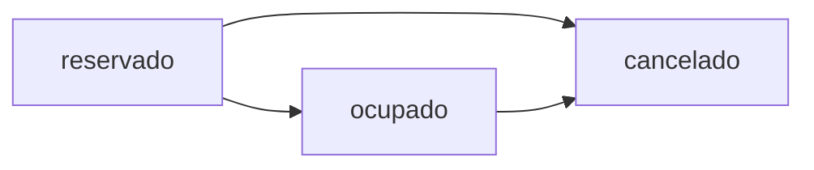

## Reserve a Classroom

<RequestExample>
```bash cURL
curl -X POST http://localhost:8000/api/v1/reservar-aula \
  -H "Content-Type: application/json" \
  -d '{
    "asignatura_id": "A001",
    "aula_id": "AU001",
    "fecha": "22/07/2024",
    "dia": "Lunes",
    "hora_inicio": "07:00",
    "hora_fin": "09:00",
    "cantidad_estudiantes": 30,
    "semestre": 1,
    "docente_id": "D001",
    "id_usuario": "USR001"
  }'
```

```python Python
import requests

url = "http://localhost:8000/api/v1/reservar-aula"
payload = {
    "asignatura_id": "A001",
    "aula_id": "AU001",
    "fecha": "22/07/2024",
    "dia": "Lunes",
    "hora_inicio": "07:00",
    "hora_fin": "09:00",
    "cantidad_estudiantes": 30,
    "semestre": 1,
    "docente_id": "D001",
    "id_usuario": "USR001"
}

response = requests.post(url, json=payload)
result = response.json()

if result['success']:
    print(f"Reserved {len(result['reservas'])} sessions")
    for reserva in result['reservas']:
        print(f"- {reserva['fecha']} at {reserva['hora_inicio']}")
```
</RequestExample>

<ResponseExample>
```json 200 Success
{
  "success": true,
  "message": "Reserva realizada para 24 sesiones.",
  "reservas": [
    {
      "id": "PROG001",
      "aula_id": "AU001",
      "docente_id": "D001",
      "asignatura_id": "A001",
      "fecha": "22/07/2024",
      "hora_inicio": "07:00",
      "hora_fin": "09:00",
      "id_usuario": "USR001",
      "fecha_creacion": "2024-07-15",
      "hora_creacion": "14:30",
      "estado": "reservado",
      "dia": "Lunes",
      "semestre": 1,
      "estudiantes": 30
    }
  ]
}
```

```json 400 Classroom Not Available
{
  "detail": "El aula seleccionada no está disponible para esta asignatura y horario. Verifique las restricciones de capacidad, compatibilidad y disponibilidad."
}
```

```json 400 Conflict
{
  "success": false,
  "message": "El aula ya está reservada el 22/07/2024 en ese horario."
}
```
</ResponseExample>

### POST /reservar-aula

Creates a classroom reservation for a course. Automatically generates recurring sessions based on course duration.

#### How It Works

1. **Validates availability** - Checks if the classroom is available using the same constraints as `/aulas-disponibles`
2. **Retrieves course duration** - Gets the course duration (e.g., "6 meses") from course data
3. **Generates recurring dates** - Creates weekly sessions for the entire course duration
4. **Checks for conflicts** - Ensures no existing reservations conflict with any generated session
5. **Creates all sessions** - Saves all reservations with status `reservado`

<Warning>
This endpoint creates recurring weekly reservations. A 6-month course will generate approximately 24 sessions.
</Warning>

#### Request Body

<ParamField body="asignatura_id" type="string" required>
  Course ID. System will retrieve course duration to generate recurring sessions.
  
  Example: `"A001"`
</ParamField>

<ParamField body="aula_id" type="string" required>
  Classroom ID to reserve. Must be available for the requested time.
  
  Example: `"AU001"`
</ParamField>

<ParamField body="fecha" type="string" required>
  Start date in format `DD/MM/YYYY`. This is the date of the first session.
  
  Example: `"22/07/2024"`
</ParamField>

<ParamField body="dia" type="string" required>
  Day of the week for recurring sessions. Must match the day of `fecha`.
  
  Example: `"Lunes"`
</ParamField>

<ParamField body="hora_inicio" type="string" required>
  Start time in format `HH:MM`.
  
  Example: `"07:00"`
</ParamField>

<ParamField body="hora_fin" type="string" required>
  End time in format `HH:MM`.
  
  Example: `"09:00"`
</ParamField>

<ParamField body="cantidad_estudiantes" type="integer" required>
  Number of students. Used for availability validation.
  
  Example: `30`
</ParamField>

<ParamField body="semestre" type="integer" required>
  Semester number (1-10).
  
  Example: `1`
</ParamField>

<ParamField body="docente_id" type="string" optional>
  Professor/instructor ID assigned to teach the course.
  
  Example: `"D001"`
</ParamField>

<ParamField body="id_usuario" type="string" required>
  User ID making the reservation. Used for audit trail.
  
  Example: `"USR001"`
</ParamField>

#### Response Fields

<ResponseField name="success" type="boolean">
  Indicates if the reservation was created successfully
</ResponseField>

<ResponseField name="message" type="string">
  Human-readable message, e.g., "Reserva realizada para 24 sesiones."
</ResponseField>

<ResponseField name="reservas" type="array">
  List of all created reservation sessions
  
  <Expandable title="reservation object">
    <ResponseField name="id" type="string">
      Unique programacion ID (auto-generated: PROG001, PROG002, etc.)
    </ResponseField>
    <ResponseField name="aula_id" type="string">
      Classroom ID
    </ResponseField>
    <ResponseField name="docente_id" type="string">
      Professor ID
    </ResponseField>
    <ResponseField name="asignatura_id" type="string">
      Course ID
    </ResponseField>
    <ResponseField name="fecha" type="string">
      Session date in DD/MM/YYYY format
    </ResponseField>
    <ResponseField name="hora_inicio" type="string">
      Start time
    </ResponseField>
    <ResponseField name="hora_fin" type="string">
      End time
    </ResponseField>
    <ResponseField name="id_usuario" type="string">
      User who created the reservation
    </ResponseField>
    <ResponseField name="fecha_creacion" type="string">
      Date when reservation was created (YYYY-MM-DD)
    </ResponseField>
    <ResponseField name="hora_creacion" type="string">
      Time when reservation was created (HH:MM)
    </ResponseField>
    <ResponseField name="estado" type="string">
      Reservation status: `reservado`, `ocupado`, or `cancelado`
    </ResponseField>
    <ResponseField name="dia" type="string">
      Day of week
    </ResponseField>
    <ResponseField name="semestre" type="integer">
      Semester number
    </ResponseField>
    <ResponseField name="estudiantes" type="integer">
      Number of students
    </ResponseField>
  </Expandable>
</ResponseField>

---

## Get All Reservations

<RequestExample>
```bash cURL
curl http://localhost:8000/api/v1/programaciones
```

```python Python
import requests

response = requests.get('http://localhost:8000/api/v1/programaciones')
data = response.json()

print(f"Total reservations: {data['total']}")
for prog in data['programaciones']:
    print(f"{prog['id']}: {prog['asignatura_id']} - {prog['estado']}")
```
</RequestExample>

<ResponseExample>
```json 200 Success
{
  "programaciones": [
    {
      "id": "PROG001",
      "aula_id": "AU001",
      "docente_id": "D001",
      "asignatura_id": "A001",
      "fecha": "2024-07-22",
      "hora_inicio": "07:00",
      "hora_fin": "09:00",
      "dia": "Lunes",
      "id_usuario": "USR001",
      "fecha_creacion": "2025-06-16",
      "hora_creacion": "21:18",
      "estado": "ocupado",
      "semestre": 1,
      "horario_id": "H_PROG001_20250617_151314",
      "fecha_confirmacion": "2025-06-17T15:13:14.191244"
    }
  ],
  "total": 1
}
```
</ResponseExample>

### GET /programaciones

Retrieves all reservations/schedules in the system.

#### Response Fields

<ResponseField name="programaciones" type="array">
  List of all programaciones (reservations)
</ResponseField>

<ResponseField name="total" type="integer">
  Total count of programaciones
</ResponseField>

---

## Get Single Reservation

<RequestExample>
```bash cURL
curl http://localhost:8000/api/v1/programaciones/PROG001
```

```python Python
import requests

prog_id = "PROG001"
response = requests.get(f'http://localhost:8000/api/v1/programaciones/{prog_id}')
programacion = response.json()

print(f"Classroom: {programacion['aula_id']}")
print(f"Status: {programacion['estado']}")
print(f"Time: {programacion['hora_inicio']} - {programacion['hora_fin']}")
```
</RequestExample>

<ResponseExample>
```json 200 Success
{
  "id": "PROG001",
  "aula_id": "AU001",
  "docente_id": "D001",
  "asignatura_id": "A001",
  "fecha": "2024-07-22",
  "hora_inicio": "07:00",
  "hora_fin": "09:00",
  "dia": "Lunes",
  "estado": "reservado",
  "semestre": 1
}
```

```json 404 Not Found
{
  "detail": "Programación no encontrada"
}
```
</ResponseExample>

### GET /programaciones/{programacion_id}

Retrieves a specific reservation by ID.

#### Path Parameters

<ParamField path="programacion_id" type="string" required>
  The unique ID of the programacion to retrieve
  
  Example: `"PROG001"`
</ParamField>

---

## Update Reservation Status

<RequestExample>
```bash cURL
curl -X PUT 'http://localhost:8000/api/v1/programaciones/PROG001/estado?nuevo_estado=ocupado'
```

```python Python
import requests

prog_id = "PROG001"
response = requests.put(
    f'http://localhost:8000/api/v1/programaciones/{prog_id}/estado',
    params={'nuevo_estado': 'ocupado'}
)
result = response.json()

if result['success']:
    print(f"Status updated: {result['programacion']['estado']}")
```
</RequestExample>

<ResponseExample>
```json 200 Success
{
  "success": true,
  "message": "Estado cambiado a ocupado",
  "programacion": {
    "id": "PROG001",
    "estado": "ocupado",
    "aula_id": "AU001",
    "asignatura_id": "A001"
  }
}
```

```json 400 Invalid Status
{
  "detail": "Estado inválido. Estados válidos: reservado, ocupado, cancelado"
}
```

```json 404 Not Found
{
  "detail": "Programación no encontrada"
}
```
</ResponseExample>

### PUT /programaciones/{programacion_id}/estado

Changes the status of a reservation.

#### Path Parameters

<ParamField path="programacion_id" type="string" required>
  ID of the programacion to update
  
  Example: `"PROG001"`
</ParamField>

#### Query Parameters

<ParamField query="nuevo_estado" type="string" required>
  New status. Valid values: `reservado`, `ocupado`, `cancelado`
  
  Example: `"ocupado"`
</ParamField>

#### Status Workflow



- **reservado**: Initial state when reservation is created
- **ocupado**: Confirmed and in use (typically set when schedule is finalized)
- **cancelado**: Reservation cancelled

---

## Cancel Reservation

<RequestExample>
```bash cURL
curl -X DELETE http://localhost:8000/api/v1/programaciones/PROG001
```

```python Python
import requests

prog_id = "PROG001"
response = requests.delete(f'http://localhost:8000/api/v1/programaciones/{prog_id}')
result = response.json()

if result['success']:
    print(f"Reservation cancelled: {prog_id}")
```
</RequestExample>

<ResponseExample>
```json 200 Success
{
  "success": true,
  "message": "Estado cambiado a cancelado",
  "programacion": {
    "id": "PROG001",
    "estado": "cancelado"
  }
}
```
</ResponseExample>

### DELETE /programaciones/{programacion_id}

Cancels a reservation by setting its status to `cancelado`.

<Note>
This is a soft delete. The programacion record is not removed, just marked as cancelled.
</Note>

#### Path Parameters

<ParamField path="programacion_id" type="string" required>
  ID of the programacion to cancel
  
  Example: `"PROG001"`
</ParamField>

## Reservation Workflow

### Complete Workflow Example

```python
import requests

BASE_URL = "http://localhost:8000/api/v1"

# Step 1: Check availability
availability = requests.post(f"{BASE_URL}/aulas-disponibles", json={
    "asignatura_id": "A001",
    "hora_inicio": "07:00",
    "hora_fin": "09:00",
    "dia": "Lunes",
    "cantidad_estudiantes": 30,
    "semestre": 1
}).json()

if availability['total_disponibles'] == 0:
    print("No classrooms available")
    exit()

# Step 2: Select first available classroom and reserve
selected_aula = availability['aulas_disponibles'][0]
reservation = requests.post(f"{BASE_URL}/reservar-aula", json={
    "asignatura_id": "A001",
    "aula_id": selected_aula['id'],
    "fecha": "22/07/2024",
    "dia": "Lunes",
    "hora_inicio": "07:00",
    "hora_fin": "09:00",
    "cantidad_estudiantes": 30,
    "semestre": 1,
    "docente_id": "D001",
    "id_usuario": "USR001"
}).json()

if reservation['success']:
    prog_id = reservation['reservas'][0]['id']
    print(f"Reserved! Programacion ID: {prog_id}")
    
    # Step 3: Later, confirm the reservation
    confirm = requests.put(
        f"{BASE_URL}/programaciones/{prog_id}/estado",
        params={'nuevo_estado': 'ocupado'}
    ).json()
    
    print(f"Confirmed: {confirm['success']}")
```