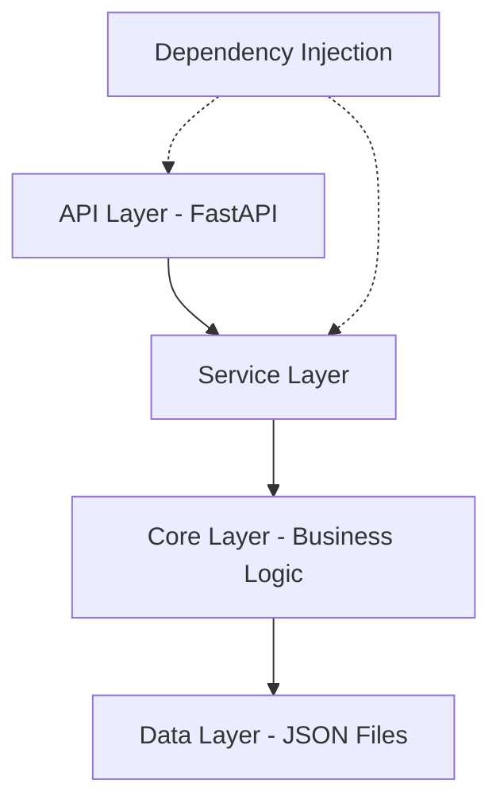
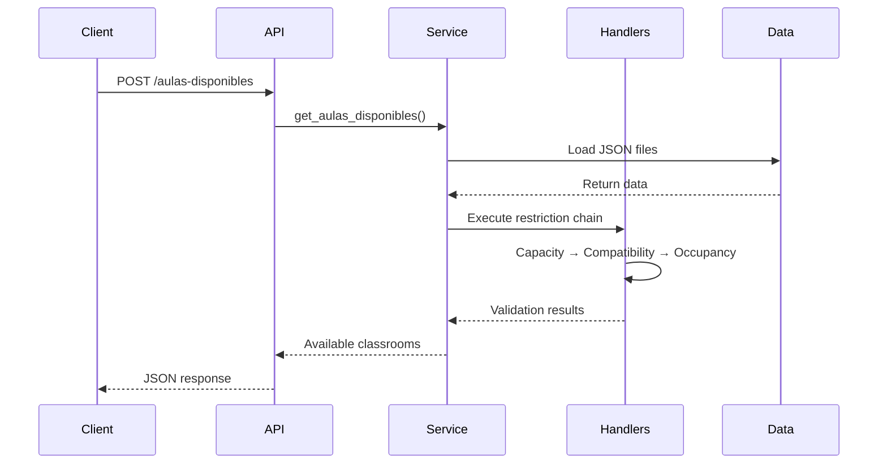

## Overview

The Automatización Backend follows a **layered architecture** pattern that separates concerns and promotes maintainability. The system is built with FastAPI and implements dependency injection for loose coupling between components.



## Architecture Layers

<CardGroup cols={2}>
  <Card title="API Layer" icon="cloud">
    FastAPI endpoints that handle HTTP requests and responses
  </Card>
  <Card title="Service Layer" icon="gears">
    Orchestrates business logic and coordinates between handlers
  </Card>
  <Card title="Core Layer" icon="microchip">
    Implements restriction handlers and schedule building patterns
  </Card>
  <Card title="Data Layer" icon="database">
    JSON-based data storage for entities (aulas, asignaturas, etc.)
  </Card>
</CardGroup>

## Layer 1: API Layer (FastAPI)

The API layer is defined in `src/api.py` and provides RESTful endpoints for the scheduling system.

### FastAPI Application Structure

```python
# src/main.py:6
app = FastAPI(
    title="Modulo Automatización",
    description="Modulo de automatización para la gestion de procesos",
    version="0.0.1",
)

app.include_router(router, prefix="/api/v1", tags=["horarios"])
```

### Dependency Injection Pattern

The API layer uses FastAPI's dependency injection system to provide service instances:

```python
# src/api.py:15
def get_aula_service() -> AulaDisponibleService:
    return AulaDisponibleService()

def get_reserva_service() -> ReservaAulaService:
    return ReservaAulaService()

@router.post("/aulas-disponibles", response_model=AulaDisponibleResponse)
def obtener_aulas_disponibles(
        request: AulaDisponibleRequest,
        service: AulaDisponibleService = Depends(get_aula_service)
) -> Dict[str, Any]:
    # Endpoint implementation
```

<Tip>
**Why Dependency Injection?** This pattern allows easy testing by injecting mock services and enables loose coupling between the API and service layers.
</Tip>

### Key API Endpoints

<Tabs>
  <Tab title="Available Classrooms">
    **POST** `/api/v1/aulas-disponibles`
    
    Finds available classrooms for a subject based on:
    - Capacity constraints
    - Compatibility requirements
    - Occupancy status
    
    ```python
    # src/api.py:31
    @router.post("/aulas-disponibles", response_model=AulaDisponibleResponse)
    def obtener_aulas_disponibles(
            request: AulaDisponibleRequest,
            service: AulaDisponibleService = Depends(get_aula_service)
    ) -> Dict[str, Any]:
        resultado = service.get_aulas_disponibles(
            asignatura_id=request.asignatura_id,
            hora_inicio=request.hora_inicio,
            hora_fin=request.hora_fin,
            dia=request.dia,
            cantidad_estudiantes=request.cantidad_estudiantes,
            semestre=request.semestre
        )
        return resultado
    ```
  </Tab>
  
  <Tab title="Reserve Classroom">
    **POST** `/api/v1/reservar-aula`
    
    Reserves a classroom after validating availability:
    
    ```python
    # src/api.py:116
    @router.post("/reservar-aula")
    async def reservar_aula(
            request: ReservaAulaRequest,
            aula_service: AulaDisponibleService = Depends(get_aula_service),
            reserva_service: ReservaAulaService = Depends(get_reserva_service)
    ):
        # Verify classroom is available
        aula_disponible = await verificar_aula_disponible(...)
        
        if not aula_disponible:
            raise HTTPException(status_code=400, detail="Aula not available")
        
        # Proceed with reservation
        result = reserva_service.reservar_aula(request.dict(), request.id_usuario)
        return result
    ```
  </Tab>
  
  <Tab title="Schedule Generation">
    **POST** `/api/v1/crear-horario-completo-semestre/{semestre}`
    
    Creates complete schedule for a semester using Builder pattern:
    
    ```python
    # src/api.py:295
    @router.post("/crear-horario-completo-semestre/{semestre}")
    def crear_horario_completo_semestre(
            semestre: int,
            validar_conjunto: bool = True,
            service: HorarioCompletoService = Depends(get_horario_completo_service)
    ):
        resultado = service.crear_horario_completo_semestre(semestre, validar_conjunto)
        if not resultado["success"]:
            raise HTTPException(status_code=400, detail=resultado["error"])
        return resultado
    ```
  </Tab>
</Tabs>

## Layer 2: Service Layer

Services orchestrate business logic and coordinate between the API and core restriction handlers.

### AulaDisponibleService

The primary service that determines classroom availability:

```python
# src/services/aula_disponible_service.py:9
class AulaDisponibleService:
    def __init__(self):
        self.data_dir = self._get_data_dir()
        self._setup_restriction_chain()  # Sets up Chain of Responsibility

    def _setup_restriction_chain(self):
        """Creates the restriction validation chain"""
        self.capacidad_handler = CapacidadAulaSuficienteHandler()
        self.compatibilidad_handler = AulaCompatibleHandler()
        self.ocupacion_handler = AulaNoOcupadaDobleHandler()
        
        # Chain the handlers together
        self.capacidad_handler.set_next(self.compatibilidad_handler)
        self.compatibilidad_handler.set_next(self.ocupacion_handler)
```

<Accordion title="Why this order?">
The chain is ordered by **computational efficiency**:
1. **Capacity** - Quick numeric comparison
2. **Compatibility** - Simple type matching
3. **Occupancy** - Requires checking all existing schedules (most expensive)

If an earlier check fails, we avoid running expensive subsequent checks.
</Accordion>

### Service Responsibilities

<CardGroup cols={2}>
  <Card title="Data Loading" icon="file-arrow-down">
    Load JSON data files (aulas, asignaturas, programaciones)
  </Card>
  <Card title="Chain Orchestration" icon="link">
    Set up and execute the restriction handler chain
  </Card>
  <Card title="Result Aggregation" icon="table">
    Collect and format results from all handlers
  </Card>
  <Card title="Error Handling" icon="triangle-exclamation">
    Transform handler errors into user-friendly messages
  </Card>
</CardGroup>

## Layer 3: Core Layer

The core layer contains business logic implemented through design patterns:

### Restriction Handlers (Chain of Responsibility)

See [Constraint System](/concepts/constraint-system) for detailed coverage.

### Schedule Builders (Builder Pattern)

See [Design Patterns](/concepts/design-patterns) for detailed coverage.

### Facade Pattern

The `HorarioFacade` provides a unified interface to the complex schedule system:

```python
# src/core/schedules/facade/horario_facade.py:12
class HorarioFacade:
    def __init__(self):
        self.creador = CreadorHorarios()
        self.validador = ValidadorHorarios()
        self.buscador = BuscadorHorarios()
        self.exportador = ExportadorHorarios()
        self.configurador = ConfiguradorSistema()
        self.estadisticas = GestorEstadisticas()
        self.restricciones = GestorRestricciones()
```

## Layer 4: Data Layer

Data is stored in JSON files for simplicity and easy inspection:

```
data/
├── aulas.json          # Classroom definitions
├── asignaturas.json    # Subject/course definitions
├── docentes.json       # Teacher information
├── programaciones.json # Schedule reservations
├── recursos.json       # Resources (projectors, computers, etc.)
└── sedes.json         # Campus/building locations
```

<Warning>
In production, consider migrating to a relational database (PostgreSQL) or document store (MongoDB) for better performance and concurrent access control.
</Warning>

## Data Flow Example

Here's how a request flows through all layers:



## Configuration and CORS

The application is configured with CORS middleware for frontend integration:

```python
# src/main.py:14
app.add_middleware(
    CORSMiddleware,
    allow_origins=["*"],  # Configure appropriately for production
    allow_credentials=True,
    allow_methods=["*"],
    allow_headers=["*"],
)
```

<Note>
**Security Note**: In production, replace `allow_origins=["*"]` with specific allowed origins.
</Note>

## Benefits of This Architecture

<AccordionGroup>
  <Accordion title="Separation of Concerns">
    Each layer has a clear, single responsibility:
    - API handles HTTP
    - Services orchestrate logic
    - Core implements business rules
    - Data manages persistence
  </Accordion>
  
  <Accordion title="Testability">
    Each layer can be tested independently:
    - API: Test with mock services
    - Services: Test with mock handlers
    - Core: Unit test business logic
    - Data: Test with fixture files
  </Accordion>
  
  <Accordion title="Maintainability">
    Changes are localized:
    - Add new endpoint → Modify API layer
    - Change validation rules → Modify handlers
    - Add new data source → Modify data layer
  </Accordion>
  
  <Accordion title="Extensibility">
    Easy to extend:
    - Add new restriction handlers to chain
    - Add new builder types
    - Add new API endpoints
    - Switch data storage backend
  </Accordion>
</AccordionGroup>

## Next Steps

<CardGroup cols={2}>
  <Card title="Design Patterns" icon="puzzle-piece" href="/concepts/design-patterns">
    Learn about Chain of Responsibility, Builder, and Facade patterns
  </Card>
  <Card title="Constraint System" icon="shield-check" href="/concepts/constraint-system">
    Understand the restriction validation system
  </Card>
  <Card title="Data Model" icon="database" href="/concepts/data-model">
    Explore the entity structure and relationships
  </Card>
</CardGroup>