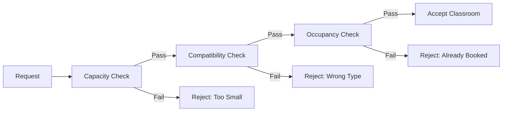
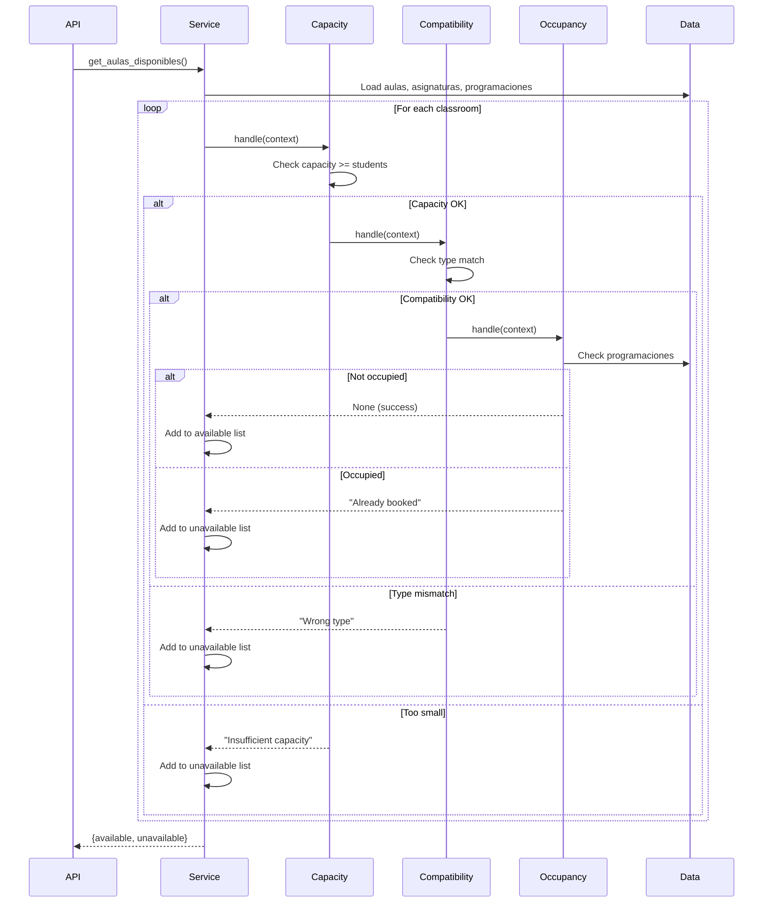

## Overview

The constraint system is the heart of the Automatización Backend. It ensures that all scheduling decisions comply with business rules using the **Chain of Responsibility** pattern.

<Info>
Every classroom assignment must satisfy three core constraints:
1. **Capacity** - Enough seats for students
2. **Compatibility** - Right type of room (lab vs. lecture)
3. **Occupancy** - Not already in use
</Info>

## Constraint Types

<CardGroup cols={3}>
  <Card title="Capacity Constraints" icon="users">
    Classroom capacity must accommodate all enrolled students
  </Card>
  <Card title="Compatibility Constraints" icon="puzzle-piece">
    Room type must match course requirements
  </Card>
  <Card title="Occupancy Constraints" icon="calendar-xmark">
    Room must be available (not double-booked)
  </Card>
</CardGroup>

## The Validation Chain

### Chain Structure

Constraints are validated in sequence for efficiency:



### Why This Order?

The chain is optimized for **early failure** - checking cheaper constraints first:

<Steps>
  <Step title="Capacity (Fastest)">
    Simple numeric comparison: `aula.capacidad >= cantidad_estudiantes`
  </Step>
  <Step title="Compatibility (Medium)">
    String comparison: `aula.tipo == asignatura.tipo_requerido`
  </Step>
  <Step title="Occupancy (Slowest)">
    Requires checking all existing schedules for time conflicts
  </Step>
</Steps>

<Tip>
If a classroom fails capacity check, we avoid the expensive occupancy check entirely!
</Tip>

## Capacity Constraint

### Business Rule

> A classroom must have enough seats to accommodate all students enrolled in the course.

### Implementation

```python
# src/core/restrictions/aulas/capacidad_aula_suficiente_handler.py:9
class CapacidadAulaSuficienteHandler(RestrictionHandler):
    """
    Restriction: Classroom must have sufficient capacity for students.
    """
    
    def __init__(self):
        super().__init__()
        self.validador_individual = ValidadorIndividualCapacidad()
        self.validador_global = ValidadorGlobalCapacidad()
        self.validador_directo = ValidadorDirectoCapacidad()
        self.buscador_aulas = BuscadorAulasCapacidad()
    
    def validate(self, context: Dict[str, Any]) -> Optional[str]:
        """Validate capacity constraint"""
        nuevo_bloque = context.get("nuevo_bloque")
        aula_directa = context.get("aula")
        
        if nuevo_bloque:
            # Validating a new schedule block
            return self.validador_individual.validar(context)
        elif aula_directa:
            # Validating a specific classroom
            return self.validador_directo.validar(context)
        else:
            # Validating entire schedule set
            return self.validador_global.validar(context)
    
    def obtener_aulas_con_capacidad_suficiente(self, context: Dict[str, Any]) -> List[str]:
        """Find all classrooms with sufficient capacity"""
        numero_estudiantes = context.get("numero_estudiantes")
        todas_aulas = context.get("todas_aulas", [])
        
        if numero_estudiantes is None:
            return []
        
        return self.buscador_aulas.obtener_aulas_con_capacidad_suficiente(
            numero_estudiantes, todas_aulas
        )
```

### Validation Logic

The capacity validator checks that the classroom can fit all students:

```python
# Simplified validation logic
def validar_capacidad(aula: Dict, num_estudiantes: int) -> Optional[str]:
    capacidad = aula.get('capacidad', 0)
    
    if capacidad < num_estudiantes:
        return f"Aula '{aula['nombre']}' tiene capacidad de {capacidad} pero requiere {num_estudiantes} estudiantes"
    
    # Optional: Check for excessive capacity (wastes resources)
    if capacidad > num_estudiantes * 2:
        # Warning but not an error
        logging.warning(f"Aula '{aula['nombre']}' está sobredimensionada para {num_estudiantes} estudiantes")
    
    return None  # Validation passed
```

### Real Data Example

<Tabs>
  <Tab title="Valid Assignment">
    ```json
    // Classroom data (data/aulas.json:3)
    {
      "id": "AU001",
      "nombre": "Aula 101",
      "tipo": "teorica",
      "capacidad": 40  // ✓ Sufficient
    }
    
    // Course request
    {
      "asignatura_id": "A001",
      "cantidad_estudiantes": 35  // ✓ Fits in AU001
    }
    
    // Result: Validation passes
    ```
  </Tab>
  
  <Tab title="Capacity Exceeded">
    ```json
    // Classroom data
    {
      "id": "AU002",
      "nombre": "Lab Computo 1",
      "tipo": "laboratorio",
      "capacidad": 25  // ✗ Too small
    }
    
    // Course request
    {
      "asignatura_id": "A003",
      "cantidad_estudiantes": 35  // ✗ Exceeds capacity
    }
    
    // Result: "Aula 'Lab Computo 1' tiene capacidad de 25 pero requiere 35 estudiantes"
    ```
  </Tab>
</Tabs>

---

## Compatibility Constraint

### Business Rule

> Laboratory courses can only be assigned to laboratory-type classrooms. Lecture courses require lecture-type classrooms.

### Classroom and Course Types

<CardGroup cols={3}>
  <Card title="Teorica" icon="chalkboard">
    Standard lecture halls with projector
  </Card>
  <Card title="Laboratorio" icon="flask">
    Computer labs or science labs with equipment
  </Card>
  <Card title="Hibrida" icon="laptop-mobile">
    Can be used for both lecture and lab
  </Card>
</CardGroup>

### Implementation

```python
# src/core/restrictions/aulas/aula_compatible_handler.py:7
class AulaCompatibleHandler(RestrictionHandler):
    """
    Restriction: Lab courses can only be assigned to lab classrooms.
    """
    
    def validate(self, context: Dict[str, Any]) -> Optional[str]:
        validator = ValidadorCompatibilidad()
        return validator.validar(context)
    
    def get_aulas_compatibles(self, context: Dict[str, Any]) -> List[Dict]:
        """Find all compatible classrooms for a course"""
        buscador = BuscadorAulasCompatibles()
        return buscador.get_aulas_compatibles(context)
```

### Compatibility Rules

<Accordion title="Compatibility Matrix">
| Course Type | Teorica | Laboratorio | Hibrida |
|------------|---------|-------------|----------|
| Teorica    | ✓       | ✗           | ✓        |
| Laboratorio| ✗       | ✓           | ✓        |
| Hibrida    | ✓       | ✓           | ✓        |
</Accordion>

### Validation Logic

```python
def validar_compatibilidad(aula: Dict, asignatura: Dict) -> Optional[str]:
    tipo_aula = aula.get('tipo', '').lower()
    tipo_asignatura = asignatura.get('tipo', '').lower()
    
    # Hibrida rooms work for everything
    if tipo_aula == 'hibrida':
        return None
    
    # Check compatibility
    compatible = (
        (tipo_asignatura == 'teorica' and tipo_aula == 'teorica') or
        (tipo_asignatura == 'laboratorio' and tipo_aula == 'laboratorio') or
        (tipo_asignatura == 'hibrida')  # Hibrida courses work in any room
    )
    
    if not compatible:
        return f"Asignatura '{asignatura['nombre']}' de tipo '{tipo_asignatura}' no puede usar aula de tipo '{tipo_aula}'"
    
    return None
```

### Real Data Example

<Tabs>
  <Tab title="Compatible">
    ```json
    // Lab course (data/asignaturas.json:36)
    {
      "id": "A004",
      "nombre": "Algoritmos y Lógica Computacional",
      "tipo": "laboratorio",  // Requires lab
      "requiereRecursos": ["R001", "R002", "R003"]
    }
    
    // Lab classroom (data/aulas.json:14)
    {
      "id": "AU002",
      "nombre": "Lab Computo 1",
      "tipo": "laboratorio",  // ✓ Match!
      "capacidad": 25
    }
    
    // Result: Compatible ✓
    ```
  </Tab>
  
  <Tab title="Incompatible">
    ```json
    // Lab course
    {
      "id": "A004",
      "nombre": "Algoritmos y Lógica Computacional",
      "tipo": "laboratorio"  // Requires lab
    }
    
    // Lecture classroom
    {
      "id": "AU001",
      "nombre": "Aula 101",
      "tipo": "teorica"  // ✗ Wrong type
    }
    
    // Result: "Asignatura 'Algoritmos y Lógica Computacional' de tipo 'laboratorio' 
    //          no puede usar aula de tipo 'teorica'"
    ```
  </Tab>
  
  <Tab title="Hybrid">
    ```json
    // Lecture course
    {
      "id": "A001",
      "nombre": "Álgebra Lineal",
      "tipo": "teorica"
    }
    
    // Hybrid classroom (data/aulas.json:36)
    {
      "id": "AU004",
      "nombre": "Aula 201",
      "tipo": "hibrida",  // ✓ Works for any type
      "capacidad": 35
    }
    
    // Result: Compatible ✓
    ```
  </Tab>
</Tabs>

---

## Occupancy Constraint

### Business Rule

> A classroom cannot be assigned to two different courses at the same time. Schedule blocks must not overlap.

**Formal Invariant:**
```
forAll(h1, h2 | h1 ≠ h2 and h1.aula = h2.aula
  implies h1.horaFin ≤ h2.horaInicio or h2.horaFin ≤ h1.horaInicio)
```

### Implementation

```python
# src/core/restrictions/aulas/aula_no_ocupada_doble_handler.py:9
class AulaNoOcupadaDobleHandler(RestrictionHandler):
    """
    Restriction: A classroom cannot have two classes at the same time.
    """
    
    def __init__(self):
        super().__init__()
        self.validador_individual = ValidadorIndividual()
        self.validador_global = ValidadorGlobal()
        self.buscador_aulas = BuscadorAulasDisponibles()
    
    def validate(self, context: Dict[str, Any]) -> Optional[str]:
        """
        Supports two validation modes:
        1. Individual: Check new block against existing schedules
        2. Global: Check entire schedule set for conflicts
        """
        nuevo_bloque = context.get("nuevo_bloque")
        
        if nuevo_bloque:
            return self.validador_individual.validar(context)
        else:
            return self.validador_global.validar(context)
    
    def obtener_aulas_disponibles(self, context: Dict[str, Any]) -> List[str]:
        """Get all available classrooms for a time slot"""
        return self.buscador_aulas.obtener_aulas_disponibles(context)
```

### Time Overlap Detection

Two schedule blocks overlap if their time ranges intersect:

```python
def horarios_solapan(h1: Dict, h2: Dict) -> bool:
    """
    Check if two time slots overlap.
    
    Non-overlapping cases:
    - h1 ends before h2 starts: h1.end <= h2.start
    - h2 ends before h1 starts: h2.end <= h1.start
    
    All other cases are overlaps.
    """
    inicio1, fin1 = h1['start_time'], h1['end_time']
    inicio2, fin2 = h2['start_time'], h2['end_time']
    
    # No overlap if one ends before the other starts
    return not (fin1 <= inicio2 or fin2 <= inicio1)
```

<Accordion title="Visual Examples">
```
Case 1: No Overlap (h1 before h2)
|----h1----|
              |----h2----|
07:00    09:00    10:00   12:00

Case 2: No Overlap (h2 before h1)
              |----h1----|
|----h2----|
07:00    09:00    10:00   12:00

Case 3: Overlap (h1 and h2 intersect)
    |----h1----|
        |----h2----|
07:00    09:00   11:00   13:00

Case 4: Complete Overlap (h1 contains h2)
|--------h1--------|
    |----h2----|
07:00    09:00   11:00   13:00
```
</Accordion>

### Validation Logic

```python
def validar_ocupacion(
    aula_id: str,
    nuevo_horario: Dict,
    programaciones_existentes: List[Dict]
) -> Optional[str]:
    """
    Check if classroom is available for the new schedule.
    """
    dia = nuevo_horario['dia']
    hora_inicio = nuevo_horario['hora_inicio']
    hora_fin = nuevo_horario['hora_fin']
    
    # Check all existing schedules for this classroom
    for prog in programaciones_existentes:
        # Skip if different classroom
        if prog['aula_id'] != aula_id:
            continue
        
        # Skip if different day
        if prog['dia'] != dia:
            continue
        
        # Skip if cancelled
        if prog.get('estado') == 'cancelado':
            continue
        
        # Check for time overlap
        if horarios_solapan(
            {'start_time': hora_inicio, 'end_time': hora_fin},
            {'start_time': prog['hora_inicio'], 'end_time': prog['hora_fin']}
        ):
            return (
                f"Aula '{aula_id}' ya está ocupada el {dia} "
                f"{prog['hora_inicio']}-{prog['hora_fin']} "
                f"(Asignatura: {prog['asignatura_id']})"
            )
    
    return None  # Classroom is available
```

### Real Data Example

<Tabs>
  <Tab title="Available">
    ```json
    // Existing schedule (data/programaciones.json:2)
    {
      "id": "PROG001",
      "aula_id": "AU001",
      "dia": "Lunes",
      "hora_inicio": "07:00",
      "hora_fin": "09:00",
      "estado": "ocupado"
    }
    
    // New request for same classroom
    {
      "aula_id": "AU001",
      "dia": "Lunes",
      "hora_inicio": "10:00",  // ✓ After existing schedule
      "hora_fin": "12:00"
    }
    
    // Result: Available ✓ (no overlap)
    ```
  </Tab>
  
  <Tab title="Conflict">
    ```json
    // Existing schedule
    {
      "id": "PROG001",
      "aula_id": "AU001",
      "dia": "Lunes",
      "hora_inicio": "07:00",
      "hora_fin": "09:00",
      "estado": "ocupado"
    }
    
    // New request (overlaps!)
    {
      "aula_id": "AU001",
      "dia": "Lunes",
      "hora_inicio": "08:00",  // ✗ Overlaps 07:00-09:00
      "hora_fin": "10:00"
    }
    
    // Result: "Aula 'AU001' ya está ocupada el Lunes 07:00-09:00
    //          (Asignatura: A001)"
    ```
  </Tab>
  
  <Tab title="Different Day">
    ```json
    // Existing schedule
    {
      "id": "PROG001",
      "aula_id": "AU001",
      "dia": "Lunes",
      "hora_inicio": "07:00",
      "hora_fin": "09:00"
    }
    
    // New request (different day)
    {
      "aula_id": "AU001",
      "dia": "Martes",  // ✓ Different day
      "hora_inicio": "07:00",
      "hora_fin": "09:00"
    }
    
    // Result: Available ✓ (different days don't conflict)
    ```
  </Tab>
</Tabs>

---

## Putting It All Together

### Service Layer Integration

The service layer builds and executes the validation chain:

```python
# src/services/aula_disponible_service.py:24
def _setup_restriction_chain(self):
    """Create the validation chain"""
    self.capacidad_handler = CapacidadAulaSuficienteHandler()
    self.compatibilidad_handler = AulaCompatibleHandler()
    self.ocupacion_handler = AulaNoOcupadaDobleHandler()
    
    # Link the chain
    self.capacidad_handler.set_next(self.compatibilidad_handler)
    self.compatibilidad_handler.set_next(self.ocupacion_handler)

def get_aulas_disponibles(self, asignatura_id, hora_inicio, hora_fin, 
                          dia, cantidad_estudiantes, semestre):
    """Find available classrooms"""
    # Load data
    aulas = self._load_json_data('aulas.json')
    asignaturas = self._load_json_data('asignaturas.json')
    programaciones = self._load_json_data('programaciones.json')
    
    asignatura = next((a for a in asignaturas if a['id'] == asignatura_id), None)
    
    aulas_disponibles = []
    aulas_no_disponibles = []
    
    # Check each classroom
    for aula in aulas:
        if aula.get('estado', '').lower() != 'activo':
            continue
        
        # Build validation context
        context = {
            'aula': aula,
            'asignatura': asignatura,
            'numero_estudiantes': cantidad_estudiantes,
            'aulas': aulas,
            'dia': dia,
            'hora_inicio': hora_inicio,
            'hora_fin': hora_fin
        }
        
        # Execute validation chain
        error = self.capacidad_handler.handle(context)
        
        if error is None:
            # Check occupancy separately (it uses programaciones)
            if not self._is_aula_ocupada(aula['id'], dia, hora_inicio, hora_fin, programaciones):
                aulas_disponibles.append(aula)
            else:
                aulas_no_disponibles.append({
                    'id': aula['id'],
                    'nombre': aula['nombre'],
                    'razon': f"Ocupada el {dia} {hora_inicio}-{hora_fin}"
                })
        else:
            aulas_no_disponibles.append({
                'id': aula['id'],
                'nombre': aula['nombre'],
                'razon': error
            })
    
    return {
        'aulas_disponibles': aulas_disponibles,
        'aulas_no_disponibles': aulas_no_disponibles
    }
```

### Complete Validation Flow



## Advanced Features

### Collecting All Errors

Instead of stopping at first failure, collect all constraint violations:

```python
# Get all errors at once
errors = handler.validate_all_and_collect_errors(context)

if errors:
    print("This assignment violates:")
    for error in errors:
        print(f"  - {error}")
```

### Chain Introspection

```python
# See what constraints will be checked
chain_info = handler.get_chain_info()
print(f"Validation chain: {' → '.join(chain_info)}")
# Output: Validation chain: CapacidadAulaSuficienteHandler → 
#                          AulaCompatibleHandler → 
#                          AulaNoOcupadaDobleHandler
```

## Extending the System

### Adding a New Constraint

To add a new constraint (e.g., "teacher availability"):

<Steps>
  <Step title="Create Handler Class">
    ```python
    class DocenteDisponibleHandler(RestrictionHandler):
        def validate(self, context: Dict[str, Any]) -> Optional[str]:
            docente = context.get('docente')
            horario = context.get('nuevo_bloque')
            
            # Check if teacher is already scheduled
            if self._tiene_conflicto(docente, horario):
                return f"Docente {docente['nombre']} ya tiene clase en este horario"
            
            return None
    ```
  </Step>
  
  <Step title="Add to Chain">
    ```python
    def _setup_restriction_chain(self):
        self.capacidad_handler = CapacidadAulaSuficienteHandler()
        self.compatibilidad_handler = AulaCompatibleHandler()
        self.docente_handler = DocenteDisponibleHandler()  # New!
        self.ocupacion_handler = AulaNoOcupadaDobleHandler()
        
        # Insert in chain
        self.capacidad_handler.set_next(self.compatibilidad_handler)
        self.compatibilidad_handler.set_next(self.docente_handler)  # New!
        self.docente_handler.set_next(self.ocupacion_handler)
    ```
  </Step>
  
  <Step title="No Other Changes Needed!">
    The existing API and service code continues to work unchanged. The new constraint is automatically enforced.
  </Step>
</Steps>

<Tip>
This is the power of the Chain of Responsibility pattern - adding new constraints requires minimal changes to existing code.
</Tip>

## Next Steps

<CardGroup cols={2}>
  <Card title="Design Patterns" icon="puzzle-piece" href="/concepts/design-patterns">
    Learn how Chain of Responsibility fits with other patterns
  </Card>
  <Card title="Data Model" icon="database" href="/concepts/data-model">
    Understand the structure of aulas, asignaturas, and programaciones
  </Card>
  <Card title="Architecture" icon="sitemap" href="/concepts/architecture">
    See how constraints fit into the overall system
  </Card>
</CardGroup>