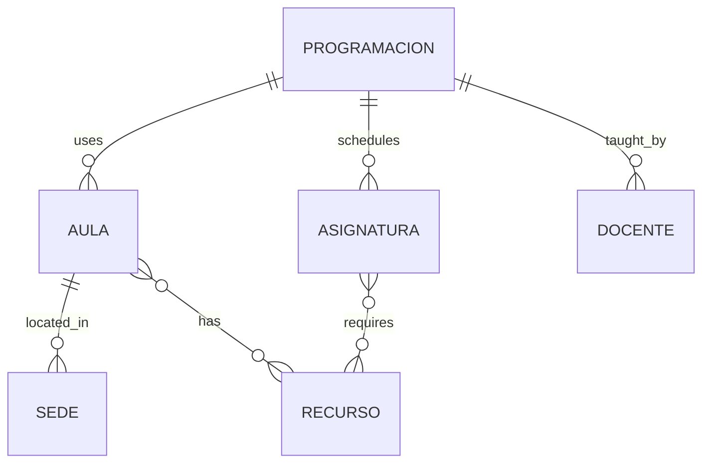
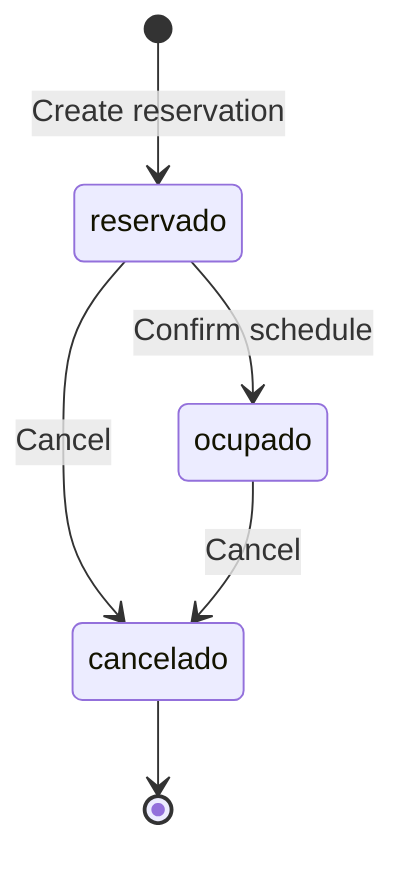

## Overview

The Automatización Backend uses a JSON-based data model with six core entities. Understanding these entities and their relationships is crucial for working with the system.



<CardGroup cols={3}>
  <Card title="Aulas" icon="chalkboard-user">
    Classrooms and labs
  </Card>
  <Card title="Asignaturas" icon="book">
    Courses and subjects
  </Card>
  <Card title="Docentes" icon="user-tie">
    Teachers and instructors
  </Card>
  <Card title="Programaciones" icon="calendar-days">
    Schedule reservations
  </Card>
  <Card title="Recursos" icon="desktop">
    Equipment and facilities
  </Card>
  <Card title="Sedes" icon="building">
    Campus locations
  </Card>
</CardGroup>

## Entity: Aulas (Classrooms)

Classrooms are the physical spaces where courses are held.

### Schema

```typescript
interface Aula {
  id: string;              // Unique identifier (e.g., "AU001")
  nombre: string;          // Display name (e.g., "Aula 101")
  estado: string;          // Status: "activo" | "inactivo" | "mantenimiento"
  codigo: string;          // Building code (e.g., "A101")
  descripcion: string;     // Description of the classroom
  tipo: string;            // Type: "teorica" | "laboratorio" | "hibrida"
  capacidad: number;       // Maximum student capacity
  id_sede: string;         // Reference to Sede (campus)
  id_recursos: string[];   // Array of Recurso IDs
}
```

### Real Examples

<Tabs>
  <Tab title="Lecture Hall">
    ```json
    // data/aulas.json:2
    {
      "id": "AU001",
      "nombre": "Aula 101",
      "estado": "activo",
      "codigo": "A101",
      "descripcion": "Aula teórica principal",
      "tipo": "teorica",
      "capacidad": 40,
      "id_sede": "S001",
      "id_recursos": ["R001", "R002"]  // Projector + Whiteboard
    }
    ```
  </Tab>
  
  <Tab title="Computer Lab">
    ```json
    // data/aulas.json:13
    {
      "id": "AU002",
      "nombre": "Lab Computo 1",
      "estado": "activo",
      "codigo": "L101",
      "descripcion": "Laboratorio de sistemas",
      "tipo": "laboratorio",
      "capacidad": 25,
      "id_sede": "S001",
      "id_recursos": ["R003"]  // Computers
    }
    ```
  </Tab>
  
  <Tab title="Hybrid Room">
    ```json
    // data/aulas.json:35
    {
      "id": "AU004",
      "nombre": "Aula 201",
      "estado": "activo",
      "codigo": "A201",
      "descripcion": "Aula híbrida para clases mixtas",
      "tipo": "hibrida",
      "capacidad": 35,
      "id_sede": "S002",
      "id_recursos": ["R001", "R004"]  // Projector + Video conferencing
    }
    ```
  </Tab>
</Tabs>

### Classroom Types

<AccordionGroup>
  <Accordion title="Teorica (Lecture)">
    Standard classrooms for theoretical courses.
    
    **Characteristics:**
    - Rows of desks/chairs
    - Projector and whiteboard
    - No specialized equipment
    
    **Used for:** Mathematics, humanities, business courses
  </Accordion>
  
  <Accordion title="Laboratorio (Laboratory)">
    Specialized spaces with equipment for hands-on learning.
    
    **Characteristics:**
    - Computers or scientific equipment
    - Individual workstations
    - Specialized software/tools
    
    **Used for:** Programming, chemistry, physics, engineering
  </Accordion>
  
  <Accordion title="Hibrida (Hybrid)">
    Flexible spaces that can be used for either type.
    
    **Characteristics:**
    - Movable furniture
    - Both lecture and lab capabilities
    - Video conferencing equipment
    
    **Used for:** Any course type
  </Accordion>
</AccordionGroup>

---

## Entity: Asignaturas (Courses)

Courses represent the subjects taught in the academic program.

### Schema

```typescript
interface Asignatura {
  id: string;              // Unique identifier (e.g., "A001")
  nombre: string;          // Course name
  estado: string;          // Status: "activo" | "inactivo"
  duracion: string;        // Duration (e.g., "6 meses")
  semestre: number;        // Academic semester (1-10)
  creditos: number;        // Credit hours
  descripcion: string;     // Course description
  requiereRecursos: string[];  // Required Recurso IDs
  tipo: string;            // Type: "teorica" | "laboratorio" | "hibrida" | "bloqueo"
}
```

### Real Examples

<Tabs>
  <Tab title="Theoretical Course">
    ```json
    // data/asignaturas.json:1
    {
      "id": "A001",
      "nombre": "Álgebra Lineal",
      "estado": "activo",
      "duracion": "6 meses",
      "semestre": 1,
      "creditos": 4,
      "descripcion": "Introducción a álgebra lineal para ingenierías",
      "requiereRecursos": ["R003"],  // Just a projector
      "tipo": "teorica"
    }
    ```
  </Tab>
  
  <Tab title="Laboratory Course">
    ```json
    // data/asignaturas.json:35
    {
      "id": "A004",
      "nombre": "Algoritmos y Lógica Computacional",
      "estado": "activo",
      "duracion": "6 meses",
      "semestre": 1,
      "creditos": 3,
      "descripcion": "Fundamentos de algoritmos y lógica computacional",
      "requiereRecursos": ["R001", "R002", "R003"],  // Computers + projector + whiteboard
      "tipo": "laboratorio"
    }
    ```
  </Tab>
  
  <Tab title="Hybrid Course">
    ```json
    // data/asignaturas.json:13
    {
      "id": "A002",
      "nombre": "Física I",
      "estado": "activo",
      "duracion": "6 meses",
      "semestre": 1,
      "creditos": 4,
      "descripcion": "Conceptos básicos de física mecánica",
      "requiereRecursos": ["R003"],
      "tipo": "hibrida"  // Has both lecture and lab components
    }
    ```
  </Tab>
</Tabs>

### Course Type Implications

The `tipo` field determines which classrooms can be used:

| Course Type | Can use Teorica | Can use Laboratorio | Can use Hibrida |
|------------|-----------------|---------------------|------------------|
| teorica    | ✓               | ✗                   | ✓                |
| laboratorio| ✗               | ✓                   | ✓                |
| hibrida    | ✓               | ✓                   | ✓                |

---

## Entity: Docentes (Teachers)

Teachers are the instructors who teach courses.

### Schema

```typescript
interface Docente {
  id: string;                  // Unique identifier (e.g., "D001")
  nombre: string;              // First name
  apellido: string;            // Last name
  email: string;               // Email address
  celular: string;             // Phone number
  cedula_ciudadania: string;   // National ID
  area_especialidad: string;   // Specialization area
  preferencias: string[];      // Scheduling preferences
  estado: string;              // Status: "activo" | "inactivo" | "licencia"
}
```

### Real Examples

```json
// data/docentes.json:1
[
  {
    "id": "D001",
    "nombre": "Laura",
    "apellido": "García",
    "email": "laura.garcia@universidad.edu",
    "celular": "3201234567",
    "cedula_ciudadania": "1002003001",
    "area_especialidad": "Matemáticas",
    "preferencias": ["mañana", "semestre_1"],
    "estado": "activo"
  },
  {
    "id": "D003",
    "nombre": "Ana",
    "apellido": "Ruiz",
    "email": "ana.ruiz@universidad.edu",
    "celular": "3151112222",
    "cedula_ciudadania": "1002003003",
    "area_especialidad": "Sistemas",
    "preferencias": ["hibrida", "semestre_2"],
    "estado": "activo"
  }
]
```

### Teacher Preferences

The `preferencias` array can include:
- **Time slots**: `"mañana"`, `"tarde"`, `"noche"`
- **Course types**: `"laboratorio"`, `"teorica"`, `"hibrida"`
- **Semesters**: `"semestre_1"`, `"semestre_2"`, etc.

<Note>
Preferences are informational - they don't currently enforce constraints, but could be used for automated schedule generation.
</Note>

---

## Entity: Programaciones (Schedule Reservations)

Programaciones represent actual schedule assignments - when a specific course is taught by a teacher in a classroom.

### Schema

```typescript
interface Programacion {
  id: string;                  // Unique identifier (e.g., "PROG001")
  aula_id: string;             // Reference to Aula
  docente_id: string;          // Reference to Docente
  asignatura_id: string;       // Reference to Asignatura
  fecha: string;               // Date (various formats)
  hora_inicio: string;         // Start time (HH:MM)
  hora_fin: string;            // End time (HH:MM)
  dia: string;                 // Day of week (Lunes, Martes, etc.)
  id_usuario: string;          // User who created the reservation
  fecha_creacion: string;      // Creation date
  hora_creacion: string;       // Creation time
  estado: string;              // Status: "reservado" | "ocupado" | "cancelado"
  semestre: number;            // Academic semester
  horario_id?: string;         // Generated schedule ID (if confirmed)
  fecha_confirmacion?: string; // Confirmation timestamp
  estudiantes?: number;        // Number of students (optional)
}
```

### Status Lifecycle



<CardGroup cols={3}>
  <Card title="Reservado" icon="bookmark">
    Initial state - classroom is tentatively booked
  </Card>
  <Card title="Ocupado" icon="calendar-check">
    Confirmed - schedule is finalized and in use
  </Card>
  <Card title="Cancelado" icon="calendar-xmark">
    Cancelled - classroom is available again
  </Card>
</CardGroup>

### Real Examples

<Tabs>
  <Tab title="Reserved">
    ```json
    // data/programaciones.json:84
    {
      "id": "PROG005",
      "aula_id": "AU004",
      "docente_id": "D003",
      "asignatura_id": "A003",
      "fecha": "2024-07-22",
      "hora_inicio": "14:00",
      "hora_fin": "16:00",
      "id_usuario": "USR001",
      "fecha_creacion": "2025-06-18",
      "hora_creacion": "01:19",
      "estado": "reservado",  // Tentative booking
      "dia": "Jueves",
      "semestre": 2
    }
    ```
  </Tab>
  
  <Tab title="Occupied (Confirmed)">
    ```json
    // data/programaciones.json:2
    {
      "id": "PROG001",
      "aula_id": "AU001",
      "docente_id": "D001",
      "asignatura_id": "A001",
      "fecha": "2024-07-22",
      "hora_inicio": "07:00",
      "hora_fin": "09:00",
      "dia": "Lunes",
      "id_usuario": "USR001",
      "fecha_creacion": "2025-06-16",
      "hora_creacion": "21:18",
      "estado": "ocupado",  // Confirmed schedule
      "semestre": 1,
      "horario_id": "H_PROG001_20250617_151314",
      "fecha_confirmacion": "2025-06-17T15:13:14.191244"
    }
    ```
  </Tab>
</Tabs>

### Understanding Time Blocking

The system checks programaciones to prevent double-booking:

```python
# src/services/aula_disponible_service.py:66
for prog in programaciones:
    if prog.get('estado') in ('reservado', 'ocupado') and prog.get('dia') == dia:
        if self._horarios_solapan(
                {'start_time': hora_inicio, 'end_time': hora_fin},
                {'start_time': prog.get('hora_inicio'), 'end_time': prog.get('hora_fin')}
        ):
            aulas_ocupadas.add(prog['aula_id'])
```

<Warning>
Both `"reservado"` and `"ocupado"` statuses block the classroom. Only `"cancelado"` frees it up.
</Warning>

---

## Entity: Recursos (Resources)

Resources are equipment and facilities available in classrooms.

### Schema

```typescript
interface Recurso {
  id: string;          // Unique identifier (e.g., "R001")
  nombre: string;      // Resource name
  descripcion: string; // Description
  tipo: string;        // Type category
  estado: string;      // Status: "disponible" | "mantenimiento" | "fuera_servicio"
}
```

### Common Resources

```json
[
  {
    "id": "R001",
    "nombre": "Proyector",
    "descripcion": "Proyector multimedia HD",
    "tipo": "audiovisual",
    "estado": "disponible"
  },
  {
    "id": "R002",
    "nombre": "Pizarra",
    "descripcion": "Pizarra acrílica grande",
    "tipo": "escritura",
    "estado": "disponible"
  },
  {
    "id": "R003",
    "nombre": "Computadores",
    "descripcion": "Estaciones de trabajo con software de desarrollo",
    "tipo": "tecnologia",
    "estado": "disponible"
  },
  {
    "id": "R004",
    "nombre": "Sistema de videoconferencia",
    "descripcion": "Cámara y micrófono para clases remotas",
    "tipo": "tecnologia",
    "estado": "disponible"
  }
]
```

### Resource Requirements

Courses specify required resources in `requiereRecursos`, and classrooms specify available resources in `id_recursos`. The system can check compatibility:

```python
def tiene_recursos_requeridos(aula: Dict, asignatura: Dict) -> bool:
    recursos_requeridos = set(asignatura.get('requiereRecursos', []))
    recursos_disponibles = set(aula.get('id_recursos', []))
    return recursos_requeridos.issubset(recursos_disponibles)
```

---

## Entity: Sedes (Campuses)

Sedes represent physical campus locations or buildings.

### Schema

```typescript
interface Sede {
  id: string;          // Unique identifier (e.g., "S001")
  nombre: string;      // Campus name
  direccion: string;   // Physical address
  ciudad: string;      // City
  estado: string;      // Status: "activo" | "inactivo"
}
```

### Example

```json
[
  {
    "id": "S001",
    "nombre": "Campus Principal",
    "direccion": "Calle 10 #20-30",
    "ciudad": "Bogotá",
    "estado": "activo"
  },
  {
    "id": "S002",
    "nombre": "Sede Norte",
    "direccion": "Carrera 15 #80-25",
    "ciudad": "Bogotá",
    "estado": "activo"
  }
]
```

<Tip>
Multiple classrooms can belong to the same sede. This helps with scheduling - you might want to avoid scheduling a teacher in different campuses on the same day.
</Tip>

---

## Entity Relationships

### Programacion References

A programacion ties together multiple entities:

```json
{
  "id": "PROG001",
  "aula_id": "AU001",        // → Aula "Aula 101"
  "docente_id": "D001",      // → Docente "Laura García"
  "asignatura_id": "A001",   // → Asignatura "Álgebra Lineal"
  "hora_inicio": "07:00",
  "hora_fin": "09:00",
  "dia": "Lunes",
  "estado": "ocupado",
  "semestre": 1
}
```

This creates the relationship:
> "Laura García teaches Álgebra Lineal in Aula 101 on Mondays 7:00-9:00"

### Loading Related Data

```python
# src/api.py:21
def load_json(filename: str) -> List[Dict[str, Any]]:
    """Load JSON data file"""
    base_dir = os.path.dirname(os.path.abspath(__file__))
    data_dir = os.path.abspath(os.path.join(base_dir, '../data'))
    with open(os.path.join(data_dir, filename), encoding="utf-8") as f:
        return json.load(f)

# Usage:
aulas = load_json("aulas.json")
asignaturas = load_json("asignaturas.json")
docentes = load_json("docentes.json")
programaciones = load_json("programaciones.json")

# Resolve references
prog = programaciones[0]
aula = next(a for a in aulas if a['id'] == prog['aula_id'])
asignatura = next(a for a in asignaturas if a['id'] == prog['asignatura_id'])
docente = next(d for d in docentes if d['id'] == prog['docente_id'])
```

### Complete Data Example

Here's how all entities work together for a single class:

<Accordion title="Complete Schedule Record">
```json
// Programacion
{
  "id": "PROG001",
  "aula_id": "AU001",
  "docente_id": "D001",
  "asignatura_id": "A001",
  "hora_inicio": "07:00",
  "hora_fin": "09:00",
  "dia": "Lunes",
  "estado": "ocupado",
  "semestre": 1
}

// Resolves to:

// Aula
{
  "id": "AU001",
  "nombre": "Aula 101",
  "tipo": "teorica",
  "capacidad": 40,
  "id_sede": "S001",
  "id_recursos": ["R001", "R002"]
}

// Docente
{
  "id": "D001",
  "nombre": "Laura",
  "apellido": "García",
  "area_especialidad": "Matemáticas"
}

// Asignatura
{
  "id": "A001",
  "nombre": "Álgebra Lineal",
  "tipo": "teorica",
  "creditos": 4,
  "requiereRecursos": ["R003"]
}

// Sede (via aula.id_sede)
{
  "id": "S001",
  "nombre": "Campus Principal",
  "ciudad": "Bogotá"
}

// Recursos (via aula.id_recursos)
[
  {"id": "R001", "nombre": "Proyector"},
  {"id": "R002", "nombre": "Pizarra"}
]
```

**Human-readable interpretation:**
> Laura García teaches Álgebra Lineal (4 credits) in Aula 101 (capacity 40, with projector and whiteboard) at Campus Principal on Mondays from 7:00-9:00.
</Accordion>

---

## Data Storage Format

### File Structure

```
data/
├── aulas.json          # 4 classrooms
├── asignaturas.json    # 5 courses
├── docentes.json       # 3 teachers
├── programaciones.json # 110+ schedule entries
├── recursos.json       # 4+ resource types
└── sedes.json         # 2 campuses
```

### JSON Format Conventions

<AccordionGroup>
  <Accordion title="IDs">
    - Prefixed by entity type: `AU` (aula), `A` (asignatura), `D` (docente), etc.
    - Zero-padded numbers: `AU001`, `AU002`
    - Consistent format for easy searching
  </Accordion>
  
  <Accordion title="Time Formats">
    - Times: 24-hour format `"HH:MM"` (e.g., `"14:30"`)
    - Dates: Various formats (inconsistent - consider standardizing to ISO 8601)
    - Days: Spanish names (`"Lunes"`, `"Martes"`, etc.)
  </Accordion>
  
  <Accordion title="Status Fields">
    - Lowercase strings: `"activo"`, `"inactivo"`, `"cancelado"`
    - Consistent vocabulary across entities
  </Accordion>
  
  <Accordion title="References">
    - Foreign keys use `_id` suffix: `aula_id`, `docente_id`
    - Arrays of references use `id_` prefix: `id_recursos`, `id_sede`
  </Accordion>
</AccordionGroup>

---

## Data Validation

### Common Validation Rules

```python
# Example validation function
def validar_programacion(prog: Dict) -> List[str]:
    errors = []
    
    # Required fields
    required = ['id', 'aula_id', 'docente_id', 'asignatura_id', 
                'hora_inicio', 'hora_fin', 'dia', 'estado']
    for field in required:
        if field not in prog or prog[field] is None:
            errors.append(f"Missing required field: {field}")
    
    # Time logic
    if prog.get('hora_inicio') and prog.get('hora_fin'):
        if prog['hora_inicio'] >= prog['hora_fin']:
            errors.append("hora_inicio must be before hora_fin")
    
    # Valid status
    valid_estados = ['reservado', 'ocupado', 'cancelado']
    if prog.get('estado') not in valid_estados:
        errors.append(f"Invalid estado: {prog['estado']}")
    
    return errors
```

---

## Migration Considerations

<Warning>
**Current limitations of JSON storage:**
- No transactions (concurrent writes may corrupt data)
- No referential integrity (orphaned references possible)
- No indexing (slow searches on large datasets)
- File locking issues on shared filesystems
</Warning>

### Recommended: PostgreSQL Schema

For production, consider migrating to a relational database:

```sql
CREATE TABLE aulas (
    id VARCHAR(10) PRIMARY KEY,
    nombre VARCHAR(100) NOT NULL,
    tipo VARCHAR(20) NOT NULL CHECK (tipo IN ('teorica', 'laboratorio', 'hibrida')),
    capacidad INTEGER NOT NULL CHECK (capacidad > 0),
    estado VARCHAR(20) NOT NULL DEFAULT 'activo',
    sede_id VARCHAR(10) REFERENCES sedes(id),
    created_at TIMESTAMP DEFAULT CURRENT_TIMESTAMP
);

CREATE TABLE programaciones (
    id VARCHAR(20) PRIMARY KEY,
    aula_id VARCHAR(10) NOT NULL REFERENCES aulas(id),
    docente_id VARCHAR(10) NOT NULL REFERENCES docentes(id),
    asignatura_id VARCHAR(10) NOT NULL REFERENCES asignaturas(id),
    dia VARCHAR(10) NOT NULL,
    hora_inicio TIME NOT NULL,
    hora_fin TIME NOT NULL,
    estado VARCHAR(20) NOT NULL,
    semestre INTEGER NOT NULL,
    created_at TIMESTAMP DEFAULT CURRENT_TIMESTAMP,
    CHECK (hora_inicio < hora_fin)
);

-- Index for fast conflict detection
CREATE INDEX idx_programaciones_aula_dia 
    ON programaciones(aula_id, dia, hora_inicio, hora_fin)
    WHERE estado IN ('reservado', 'ocupado');
```

---

## Next Steps

<CardGroup cols={2}>
  <Card title="Architecture" icon="sitemap" href="/concepts/architecture">
    Learn how data flows through the system layers
  </Card>
  <Card title="Constraint System" icon="shield-check" href="/concepts/constraint-system">
    See how entities are validated during scheduling
  </Card>
  <Card title="API Reference" icon="code" href="/api/overview">
    Start building with the API
  </Card>
</CardGroup>