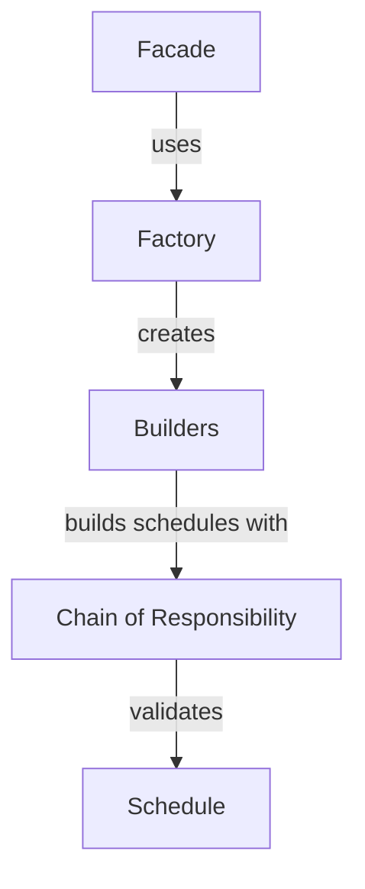

## Overview

The Automatización Backend leverages several classic design patterns to create a maintainable, extensible system. Each pattern was chosen to solve specific architectural challenges.

<CardGroup cols={2}>
  <Card title="Chain of Responsibility" icon="link">
    Sequential validation of scheduling constraints
  </Card>
  <Card title="Builder Pattern" icon="hammer">
    Flexible construction of different schedule types
  </Card>
  <Card title="Facade Pattern" icon="window">
    Simplified interface to complex subsystems
  </Card>
  <Card title="Factory Pattern" icon="industry">
    Dynamic creation of builder instances
  </Card>
</CardGroup>

## Chain of Responsibility Pattern

### Purpose

The Chain of Responsibility pattern allows multiple restriction handlers to validate scheduling constraints in sequence. If any handler fails, the chain stops and returns an error.

### Why This Pattern?

<Accordion title="Problem: Multiple Independent Validations">
Scheduling a classroom requires checking:
- **Capacity**: Does the classroom fit all students?
- **Compatibility**: Is it the right type (lab vs. lecture)?
- **Occupancy**: Is it available at that time?

Without a pattern, this leads to deeply nested if-statements and tight coupling.
</Accordion>

<Accordion title="Solution: Chain of Handlers">
Each restriction is a self-contained handler that:
1. Validates its specific constraint
2. Either returns an error OR passes control to the next handler
3. Can be easily added, removed, or reordered
</Accordion>

### Implementation

#### Base Handler Class

```python
# src/core/restrictions/restriction_handler.py:17
class RestrictionHandler(ABC):
    """
    Base class for all restriction handlers.
    Implements the Chain of Responsibility pattern.
    """
    
    def __init__(self, next_handler: Optional['RestrictionHandler'] = None):
        self._next_handler = next_handler
        self._logger = logging.getLogger(self.__class__.__name__)
    
    def set_next(self, next_handler: 'RestrictionHandler') -> 'RestrictionHandler':
        """Chain handlers together"""
        self._next_handler = next_handler
        return next_handler
    
    def handle(self, context: Dict[str, Any]) -> Optional[str]:
        """Process validation in chain"""
        # Validate context structure
        context_validation = self._validate_context_structure(context)
        if context_validation is not None:
            return context_validation
        
        # Execute specific validation
        result = self.validate(context)
        
        if result is not None:
            # Validation failed - return error
            return result
        
        # Success - continue to next handler
        if self._next_handler:
            return self._next_handler.handle(context)
        
        return None  # All validations passed!
    
    @abstractmethod
    def validate(self, context: Dict[str, Any]) -> Optional[str]:
        """Subclasses implement specific validation logic"""
        pass
```

#### Concrete Handler: Capacity Check

```python
# src/core/restrictions/aulas/capacidad_aula_suficiente_handler.py:9
class CapacidadAulaSuficienteHandler(RestrictionHandler):
    """
    Restriction: Classroom must have sufficient capacity for students.
    """
    
    def __init__(self):
        super().__init__()
        self.validador_individual = ValidadorIndividualCapacidad()
        self.validador_global = ValidadorGlobalCapacidad()
        self.validador_directo = ValidadorDirectoCapacidad()
        self.buscador_aulas = BuscadorAulasCapacidad()
    
    def validate(self, context: Dict[str, Any]) -> Optional[str]:
        nuevo_bloque = context.get("nuevo_bloque")
        aula_directa = context.get("aula")
        
        if nuevo_bloque:
            return self.validador_individual.validar(context)
        elif aula_directa:
            return self.validador_directo.validar(context)
        else:
            return self.validador_global.validar(context)
```

#### Concrete Handler: Compatibility Check

```python
# src/core/restrictions/aulas/aula_compatible_handler.py:7
class AulaCompatibleHandler(RestrictionHandler):
    """
    Restriction: Lab courses can only be assigned to lab classrooms.
    """
    
    def validate(self, context: Dict[str, Any]) -> Optional[str]:
        validator = ValidadorCompatibilidad()
        return validator.validar(context)
    
    def get_aulas_compatibles(self, context: Dict[str, Any]) -> List[Dict]:
        buscador = BuscadorAulasCompatibles()
        return buscador.get_aulas_compatibles(context)
```

#### Concrete Handler: Occupancy Check

```python
# src/core/restrictions/aulas/aula_no_ocupada_doble_handler.py:9
class AulaNoOcupadaDobleHandler(RestrictionHandler):
    """
    Restriction: A classroom cannot have two classes at the same time.
    
    Invariant: forAll(h1, h2 | h1 <> h2 and h1.aula = h2.aula
               implies h1.horaFin <= h2.horaInicio or h2.horaFin <= h1.horaInicio)
    """
    
    def __init__(self):
        super().__init__()
        self.validador_individual = ValidadorIndividual()
        self.validador_global = ValidadorGlobal()
        self.buscador_aulas = BuscadorAulasDisponibles()
    
    def validate(self, context: Dict[str, Any]) -> Optional[str]:
        nuevo_bloque = context.get("nuevo_bloque")
        
        if nuevo_bloque:
            # Check new block against existing schedules
            return self.validador_individual.validar(context)
        else:
            # Check entire schedule set for conflicts
            return self.validador_global.validar(context)
```

### Building the Chain

```python
# src/services/aula_disponible_service.py:24
def _setup_restriction_chain(self):
    """Create and link handlers in order"""
    self.capacidad_handler = CapacidadAulaSuficienteHandler()
    self.compatibilidad_handler = AulaCompatibleHandler()
    self.ocupacion_handler = AulaNoOcupadaDobleHandler()
    
    # Chain them: Capacity → Compatibility → Occupancy
    self.capacidad_handler.set_next(self.compatibilidad_handler)
    self.compatibilidad_handler.set_next(self.ocupacion_handler)

# Execute the chain
error = self.capacidad_handler.handle(context)
if error:
    # Validation failed
    print(f"Cannot assign classroom: {error}")
```

<Tip>
**Chain Order Matters!** Handlers are ordered by computational cost:
1. Capacity (cheapest - simple comparison)
2. Compatibility (medium - type checking)
3. Occupancy (expensive - checks all schedules)
</Tip>

### Advanced Features

#### Collect All Errors

Instead of stopping at the first failure, collect all errors:

```python
# src/core/restrictions/restriction_handler.py:139
def validate_all_and_collect_errors(self, context: Dict[str, Any]) -> List[str]:
    """
    Execute all validations and collect ALL errors.
    Useful for showing users all problems at once.
    """
    errors = []
    
    # Validate this handler
    result = self.validate(context)
    if result is not None:
        errors.append(result)
    
    # Continue with next handler regardless
    if self._next_handler:
        next_errors = self._next_handler.validate_all_and_collect_errors(context)
        errors.extend(next_errors)
    
    return errors
```

#### Chain Inspection

```python
# src/core/restrictions/restriction_handler.py:126
def get_chain_info(self) -> List[str]:
    """Get all handler names in the chain"""
    chain = [self.get_handler_name()]
    if self._next_handler:
        chain.extend(self._next_handler.get_chain_info())
    return chain

# Usage:
print(handler.get_chain_info())
# ['CapacidadAulaSuficienteHandler', 'AulaCompatibleHandler', 'AulaNoOcupadaDobleHandler']
```

---

## Builder Pattern

### Purpose

The Builder pattern constructs complex schedule objects step-by-step, allowing different types of schedules (normal, lab, virtual, block) to be built with the same construction process.

### Why This Pattern?

<Accordion title="Problem: Complex Object Construction">
Creating a schedule requires:
- Teacher assignment
- Classroom assignment
- Subject details
- Time slots
- Campus location
- Type-specific validation

Different schedule types have different requirements and validation rules.
</Accordion>

<Accordion title="Solution: Step-by-Step Construction">
Separate the construction process from the final representation:
1. **Builder Interface**: Defines construction steps
2. **Concrete Builders**: Implement steps for each schedule type
3. **Director**: Orchestrates the building process
4. **Factory**: Creates the appropriate builder
</Accordion>

### Implementation

#### Builder Interface

```python
# src/core/schedules/builders/horario_builder_interface.py:6
class IHorarioBuilder(ABC):
    """Interface defining methods to build schedules"""
    
    @abstractmethod
    def reset(self) -> 'IHorarioBuilder':
        """Reset builder for new schedule"""
        pass
    
    @abstractmethod
    def set_docente(self, docente: Dict[str, Any]) -> 'IHorarioBuilder':
        """Set teacher"""
        pass
    
    @abstractmethod
    def set_aula(self, aula: Dict[str, Any]) -> 'IHorarioBuilder':
        """Set classroom"""
        pass
    
    @abstractmethod
    def set_asignatura(self, asignatura: Dict[str, Any]) -> 'IHorarioBuilder':
        """Set subject"""
        pass
    
    @abstractmethod
    def set_tiempo(self, start_time: str, end_time: str) -> 'IHorarioBuilder':
        """Set time slot"""
        pass
    
    @abstractmethod
    def build(self) -> HorarioBase:
        """Construct and return the schedule"""
        pass
```

<Note>
All setter methods return `self` to enable **method chaining**: 
`builder.set_docente(d).set_aula(a).set_asignatura(s).build()`
</Note>

#### Concrete Builder: Normal Classes

```python
# src/core/schedules/builders/horario_normal_builder.py:6
class HorarioNormalBuilder(HorarioBuilderBase):
    """Builder for regular lecture classes"""
    
    def validate_build_data(self) -> str | None:
        """Validate all required fields are present"""
        required_fields = {
            'docente': self._docente,
            'aula': self._aula,
            'asignatura': self._asignatura,
            'start_time': self._start_time,
            'end_time': self._end_time,
            'dia': self._dia,
            'sede': self._sede,
            'id': self._id
        }
        missing_fields = [field for field, value in required_fields.items() if value is None]
        if missing_fields:
            return f"Missing required fields: {missing_fields}"
        return None
    
    def build(self) -> HorarioBase:
        validation_error = self.validate_build_data()
        if validation_error:
            raise ValueError(f"Error building normal schedule: {validation_error}")
        
        self._validate_normal_requirements()
        
        horario = HorarioClaseNormal(
            docente=self._docente,
            aula=self._aula,
            asignatura=self._asignatura,
            start_time=self._start_time,
            end_time=self._end_time,
            dia=self._dia,
            sede=self._sede
        )
        return horario
    
    def _validate_normal_requirements(self) -> None:
        """Validate business rules for normal classes"""
        # Classroom must be lecture-type
        aula_tipo = self._aula.get('tipo', '').lower()
        if aula_tipo not in ['aula', 'teorica']:
            raise ValueError("Classroom must be 'aula' or 'teorica' type for normal class")
        
        # Duration constraints
        start_hour, start_min = map(int, self._start_time.split(':'))
        end_hour, end_min = map(int, self._end_time.split(':'))
        duration_minutes = (end_hour * 60 + end_min) - (start_hour * 60 + start_min)
        
        if duration_minutes < 50:
            raise ValueError("Normal classes must be at least 50 minutes")
        if duration_minutes > 180:
            raise ValueError("Normal classes cannot exceed 3 hours")
```

<Tabs>
  <Tab title="Normal Builder">
    ```python
    class HorarioNormalBuilder(HorarioBuilderBase):
        # Requires: all fields
        # Validates: duration 50-180 min, classroom type 'teorica'
        def get_tipo(self) -> str:
            return 'normal'
    ```
  </Tab>
  
  <Tab title="Lab Builder">
    ```python
    class HorarioLaboratorioBuilder(HorarioBuilderBase):
        # Requires: all fields
        # Validates: duration 100-240 min, classroom type 'laboratorio'
        def get_tipo(self) -> str:
            return 'laboratorio'
    ```
  </Tab>
  
  <Tab title="Virtual Builder">
    ```python
    class HorarioVirtualBuilder(HorarioBuilderBase):
        # Requires: docente, asignatura, tiempo (no aula or sede)
        # Validates: has meeting URL
        def get_tipo(self) -> str:
            return 'virtual'
    ```
  </Tab>
  
  <Tab title="Block Builder">
    ```python
    class HorarioBloqueoBuilder(HorarioBuilderBase):
        # Requires: aula, tiempo, razon (no docente or asignatura)
        # Used for: maintenance, events, closures
        def get_tipo(self) -> str:
            return 'bloqueo'
    ```
  </Tab>
</Tabs>

#### Director

The Director orchestrates the building process:

```python
# src/core/schedules/builders/horario_director.py:6
class HorarioDirector:
    """Orchestrates schedule construction using a builder"""
    
    def __init__(self):
        self._builder = None
    
    def set_builder(self, builder: IHorarioBuilder) -> None:
        self._builder = builder
    
    def construct_horario_completo(self, datos: Dict[str, Any]) -> HorarioBase:
        """Build a complete schedule from data dictionary"""
        if not self._builder:
            raise ValueError("No builder configured")
        
        self._builder.reset()
        
        # Set data only if present
        if datos.get('docente') is not None:
            self._builder.set_docente(datos['docente'])
        if datos.get('aula') is not None:
            self._builder.set_aula(datos['aula'])
        if datos.get('asignatura') is not None:
            self._builder.set_asignatura(datos['asignatura'])
        if datos.get('start_time') is not None and datos.get('end_time') is not None:
            self._builder.set_tiempo(datos['start_time'], datos['end_time'])
        # ... set other fields
        
        return self._builder.build()
```

#### Factory Pattern for Builders

```python
# src/core/schedules/builders/builder_factory.py:10
class BuilderFactory:
    """Factory to create builder instances"""
    
    _builders: Dict[str, Type[IHorarioBuilder]] = {
        'normal': HorarioNormalBuilder,
        'laboratorio': HorarioLaboratorioBuilder,
        'virtual': HorarioVirtualBuilder,
        'bloqueo': HorarioBloqueoBuilder
    }
    
    @classmethod
    def create_builder(cls, tipo: str) -> IHorarioBuilder:
        """Create builder of specified type"""
        if tipo not in cls._builders:
            available_types = list(cls._builders.keys())
            raise ValueError(f"Builder type '{tipo}' not available. "
                           f"Available: {available_types}")
        
        builder_class = cls._builders[tipo]
        return builder_class()
    
    @classmethod
    def register_builder(cls, tipo: str, builder_class: Type[IHorarioBuilder]) -> None:
        """Register a new builder type"""
        if not issubclass(builder_class, IHorarioBuilder):
            raise ValueError(f"{builder_class.__name__} must implement IHorarioBuilder")
        cls._builders[tipo] = builder_class
```

### Usage Example

```python
# Create a normal class schedule
director = HorarioDirector()
builder = BuilderFactory.create_builder('normal')
director.set_builder(builder)

horario = director.construct_horario_completo({
    'docente': {'id': 'D001', 'nombre': 'Laura García'},
    'aula': {'id': 'AU001', 'nombre': 'Aula 101', 'tipo': 'teorica'},
    'asignatura': {'id': 'A001', 'nombre': 'Álgebra Lineal'},
    'start_time': '07:00',
    'end_time': '09:00',
    'dia': 'Lunes',
    'sede': {'id': 'S001', 'nombre': 'Campus Principal'},
    'id': 'H001'
})

print(horario.to_dict())
```

---

## Facade Pattern

### Purpose

The Facade pattern provides a simplified, unified interface to the complex schedule management subsystem.

### Why This Pattern?

<Accordion title="Problem: Complex Subsystem">
The schedule system has many components:
- Schedule creators
- Validators
- Searchers
- Exporters
- Statistics managers
- Configuration handlers

Clients would need to know about and interact with all of them.
</Accordion>

<Accordion title="Solution: Single Entry Point">
Provide one `HorarioFacade` class that:
- Hides subsystem complexity
- Delegates to appropriate components
- Provides a simple, consistent API
</Accordion>

### Implementation

```python
# src/core/schedules/facade/horario_facade.py:12
class HorarioFacade:
    """
    Facade providing unified interface to schedule system.
    Coordinates creation, validation, and management of schedules.
    """
    
    def __init__(self):
        # Initialize all subsystem components
        self.creador = CreadorHorarios()
        self.validador = ValidadorHorarios()
        self.buscador = BuscadorHorarios()
        self.exportador = ExportadorHorarios()
        self.configurador = ConfiguradorSistema()
        self.estadisticas = GestorEstadisticas()
        self.restricciones = GestorRestricciones()
    
    # Simplified methods delegate to subsystems
    
    def crear_horario(self, tipo: str, validar: bool = True, **kwargs) -> Tuple[Any, Optional[str]]:
        """Create and optionally validate a schedule"""
        # 1. Create schedule
        horario, error = self.creador.crear_horario(tipo, validar, **kwargs)
        if error:
            self.estadisticas._update_stats('validaciones_fallidas')
            return None, error
        
        # 2. Validate if requested
        if validar:
            es_valido, error_validacion = self.validador.validar_horario(
                horario.to_dict() if hasattr(horario, 'to_dict') else horario
            )
            if not es_valido:
                self.estadisticas._update_stats('validaciones_fallidas')
                return horario, f"Constraint violated: {error_validacion}"
        
        # 3. Update stats
        self.estadisticas._update_stats('horarios_creados')
        self.estadisticas._update_stats('validaciones_exitosas')
        return horario, None
    
    def buscar_horarios_docente(self, docente_id: str, horarios: List[Any]) -> List[Any]:
        """Find all schedules for a teacher"""
        return self.buscador.buscar_horarios_docente(docente_id, horarios)
    
    def detectar_conflictos(self, horarios: List[Any]) -> Dict[str, List[str]]:
        """Detect scheduling conflicts"""
        return self.validador.detectar_conflictos(horarios)
    
    def obtener_resumen_sistema(self) -> Dict[str, Any]:
        """Get complete system summary"""
        return {
            'facade_version': '2.0',
            'tipos_horarios_disponibles': self.obtener_tipos_horarios_disponibles(),
            'configuracion': self.obtener_configuracion(),
            'estadisticas': self.obtener_estadisticas(),
            'restricciones_configuradas': self.restricciones.obtener_info_restricciones()
        }
```

### Benefits

<CardGroup cols={2}>
  <Card title="Simplified API" icon="hand-wave">
    One class instead of seven separate subsystems
  </Card>
  <Card title="Loose Coupling" icon="link-slash">
    Clients don't depend on internal components
  </Card>
  <Card title="Easier Testing" icon="vial">
    Mock the facade instead of all subsystems
  </Card>
  <Card title="Coordinated Operations" icon="handshake">
    Facade handles multi-step operations (create + validate + stats)
  </Card>
</CardGroup>

---

## Pattern Relationships

These patterns work together:



<CardGroup cols={2}>
  <Card title="Architecture Overview" icon="sitemap" href="/concepts/architecture">
    See how patterns fit into the overall architecture
  </Card>
  <Card title="Constraint System" icon="shield-check" href="/concepts/constraint-system">
    Deep dive into the Chain of Responsibility for validation
  </Card>
</CardGroup>