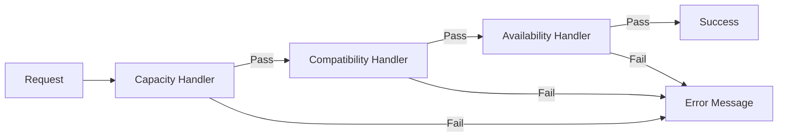

## Overview

The constraint validation system uses the **Chain of Responsibility** pattern to validate room assignments and schedules. Each validation rule is encapsulated in a handler that can pass control to the next handler in the chain.

## How the Chain Works



<Steps>
  <Step title="Request Enters Chain">
    Validation context is passed to the first handler
  </Step>
  
  <Step title="Handler Validates">
    Each handler checks its specific constraint
  </Step>
  
  <Step title="Pass or Fail">
    If validation passes, control moves to next handler. If it fails, error message is returned.
  </Step>
  
  <Step title="Chain Completes">
    All handlers pass: validation succeeds. Any handler fails: validation fails.
  </Step>
</Steps>

## Built-in Constraint Handlers

The system includes several pre-built validation handlers:

### 1. Capacity Handler

**Location**: `src/core/restrictions/aulas/capacidad_aula_suficiente_handler.py`

**Validates**: Room has sufficient capacity for the number of students

```python
# Validation logic
if aula.capacidad < numero_estudiantes:
    return f"Capacidad insuficiente: {aula.capacidad} lugares para {numero_estudiantes} estudiantes"
```

**Example**:
```json
{
  "aula": {"id": "AU002", "capacidad": 25},
  "numero_estudiantes": 30
}
// Returns: "Capacidad insuficiente: 25 lugares para 30 estudiantes"
```

### 2. Compatibility Handler

**Location**: `src/core/restrictions/aulas/aula_compatible_handler.py`

**Validates**: Room type matches course requirements

```python
# Validation rules
if asignatura.tipo == 'laboratorio':
    # Must be a lab room
    if aula.tipo != 'laboratorio':
        return f"El aula de tipo {aula.tipo} no es compatible con la asignatura de tipo laboratorio"
```

**Compatibility Matrix**:

| Course Type | Compatible Room Types |
|-------------|----------------------|
| laboratorio | laboratorio only |
| teorica | teorica, hibrida |
| hibrida | hibrida |
| virtual | any |
| bloqueo | any |

### 3. Availability Handler

**Location**: `src/core/restrictions/aulas/aula_no_ocupada_doble_handler.py`

**Validates**: Room is not occupied at the requested time

```python
# Time overlap check
def horarios_solapan(h1, h2):
    return not (h1.hora_fin <= h2.hora_inicio or h2.hora_fin <= h1.hora_inicio)

if horarios_solapan(nuevo_horario, horario_existente):
    return f"Aula ocupada en el horario {hora_inicio}-{hora_fin}"
```

<Note>
The availability check considers all reservations with `reservado` or `ocupado` status, regardless of semester.
</Note>

## Setting Up the Validation Chain

The chain is configured in `AulaDisponibleService`:

```python
class AulaDisponibleService:
    def _setup_restriction_chain(self):
        # Create handlers
        self.capacidad_handler = CapacidadAulaSuficienteHandler()
        self.compatibilidad_handler = AulaCompatibleHandler()
        self.ocupacion_handler = AulaNoOcupadaDobleHandler()
        
        # Link chain: capacity -> compatibility -> availability
        self.capacidad_handler.set_next(self.compatibilidad_handler)
        self.compatibilidad_handler.set_next(self.ocupacion_handler)
    
    def get_aulas_disponibles(self, ...):
        # Build context
        context = {
            'aula': aula,
            'asignatura': asignatura,
            'numero_estudiantes': cantidad_estudiantes,
            'dia': dia,
            'hora_inicio': hora_inicio,
            'hora_fin': hora_fin
        }
        
        # Execute chain
        error = self.capacidad_handler.handle(context)
        
        if error is None:
            # All validations passed
            aulas_disponibles.append(aula)
        else:
            # At least one validation failed
            aulas_no_disponibles.append({
                'id': aula['id'],
                'razon': error
            })
```

## Creating Custom Handlers

### Base Handler Class

All handlers extend `RestrictionHandler`:

```python
from src.core.restrictions.restriction_handler import RestrictionHandler
from typing import Optional, Dict, Any

class RestrictionHandler(ABC):
    """Base class for all constraint handlers."""
    
    def __init__(self, next_handler: Optional['RestrictionHandler'] = None):
        self._next_handler = next_handler
    
    def set_next(self, next_handler: 'RestrictionHandler') -> 'RestrictionHandler':
        """Set the next handler in the chain."""
        self._next_handler = next_handler
        return next_handler
    
    def handle(self, context: Dict[str, Any]) -> Optional[str]:
        """Execute validation and pass to next handler."""
        # Validate context structure
        context_validation = self._validate_context_structure(context)
        if context_validation is not None:
            return context_validation
        
        # Execute specific validation
        result = self.validate(context)
        
        if result is not None:
            # Validation failed
            return result
        
        # Pass to next handler
        if self._next_handler:
            return self._next_handler.handle(context)
        
        return None
    
    @abstractmethod
    def validate(self, context: Dict[str, Any]) -> Optional[str]:
        """Implement specific validation logic."""
        raise NotImplementedError("Must implement validate() in subclasses")
```

### Example: Custom Minimum Capacity Handler

Create a handler that ensures rooms have a minimum capacity buffer:

<CodeGroup>

```python Custom Handler
from src.core.restrictions.restriction_handler import RestrictionHandler
from typing import Optional, Dict, Any

class MinimumCapacityBufferHandler(RestrictionHandler):
    """Ensures room has at least 10% extra capacity beyond student count."""
    
    def __init__(self, buffer_percentage: float = 0.10):
        super().__init__()
        self.buffer_percentage = buffer_percentage
    
    def validate(self, context: Dict[str, Any]) -> Optional[str]:
        """Validate minimum capacity buffer."""
        aula = context.get('aula')
        numero_estudiantes = context.get('numero_estudiantes')
        
        if not aula or numero_estudiantes is None:
            return "Missing required context: aula or numero_estudiantes"
        
        capacidad = aula.get('capacidad', 0)
        required_capacity = numero_estudiantes * (1 + self.buffer_percentage)
        
        if capacidad < required_capacity:
            return (f"Capacidad insuficiente con buffer: "
                   f"{capacidad} lugares disponibles, "
                   f"se requieren al menos {int(required_capacity)} "
                   f"(incluye {int(self.buffer_percentage*100)}% buffer)")
        
        return None
```

```python Integration
from src.services.aula_disponible_service import AulaDisponibleService
from my_handlers import MinimumCapacityBufferHandler

class CustomAulaDisponibleService(AulaDisponibleService):
    """Extended service with custom validation."""
    
    def _setup_restriction_chain(self):
        # Create handlers
        self.buffer_handler = MinimumCapacityBufferHandler(buffer_percentage=0.15)
        self.capacidad_handler = CapacidadAulaSuficienteHandler()
        self.compatibilidad_handler = AulaCompatibleHandler()
        self.ocupacion_handler = AulaNoOcupadaDobleHandler()
        
        # Link chain with custom handler first
        self.buffer_handler.set_next(self.capacidad_handler)
        self.capacidad_handler.set_next(self.compatibilidad_handler)
        self.compatibilidad_handler.set_next(self.ocupacion_handler)
    
    def get_aulas_disponibles(self, ...):
        # ... context building ...
        
        # Start chain with custom handler
        error = self.buffer_handler.handle(context)
        
        # ... rest of logic ...
```

</CodeGroup>

### Example: Resource Requirement Handler

Validate that rooms have required resources:

```python
class ResourceRequirementHandler(RestrictionHandler):
    """Validates room has all required resources for the course."""
    
    def validate(self, context: Dict[str, Any]) -> Optional[str]:
        aula = context.get('aula')
        asignatura = context.get('asignatura')
        
        if not aula or not asignatura:
            return "Missing required context: aula or asignatura"
        
        required_resources = set(asignatura.get('requiereRecursos', []))
        available_resources = set(aula.get('id_recursos', []))
        
        missing = required_resources - available_resources
        
        if missing:
            return (f"Aula no tiene los recursos requeridos: "
                   f"{', '.join(missing)}")
        
        return None
```

### Example: Same Campus Handler

Ensure teacher's other classes are on the same campus:

```python
class SameCampusHandler(RestrictionHandler):
    """Validates room is on the same campus as teacher's other classes."""
    
    def validate(self, context: Dict[str, Any]) -> Optional[str]:
        aula = context.get('aula')
        docente = context.get('docente')
        programaciones = context.get('programaciones', [])
        dia = context.get('dia')
        
        if not all([aula, docente, dia]):
            return None  # Skip if not all data available
        
        aula_sede = aula.get('id_sede')
        docente_id = docente.get('id')
        
        # Find teacher's other classes on same day
        other_classes = [
            p for p in programaciones
            if p.get('docente_id') == docente_id 
            and p.get('dia') == dia
            and p.get('estado') in ['reservado', 'ocupado']
        ]
        
        if other_classes:
            # Get sedes from other classes
            other_sedes = set()
            aulas_dict = context.get('aulas', [])
            for clase in other_classes:
                aula_id = clase.get('aula_id')
                aula_info = next((a for a in aulas_dict if a['id'] == aula_id), None)
                if aula_info:
                    other_sedes.add(aula_info.get('id_sede'))
            
            if other_sedes and aula_sede not in other_sedes:
                return (f"El docente tiene clases en otra sede el {dia}. "
                       f"Se recomienda mantener todas las clases en la misma sede.")
        
        return None
```

## Advanced: Collecting All Errors

By default, the chain stops at the first error. To collect all validation errors:

```python
from src.core.restrictions.restriction_handler import RestrictionHandler

def validate_all_constraints(aula, asignatura, context):
    """Collect all validation errors instead of stopping at first."""
    
    # Build context
    validation_context = {
        'aula': aula,
        'asignatura': asignatura,
        **context
    }
    
    # Create chain
    capacidad_handler = CapacidadAulaSuficienteHandler()
    compatibilidad_handler = AulaCompatibleHandler()
    ocupacion_handler = AulaNoOcupadaDobleHandler()
    
    capacidad_handler.set_next(compatibilidad_handler)
    compatibilidad_handler.set_next(ocupacion_handler)
    
    # Collect all errors
    errors = capacidad_handler.validate_all_and_collect_errors(validation_context)
    
    return errors

# Usage
errors = validate_all_constraints(aula, asignatura, {
    'numero_estudiantes': 30,
    'dia': 'Lunes',
    'hora_inicio': '14:00',
    'hora_fin': '17:00',
    'programaciones': existing_reservations
})

if errors:
    print("Validation failed with errors:")
    for error in errors:
        print(f"  - {error}")
else:
    print("All validations passed")
```

## Context Structure

Validation context typically includes:

```python
context = {
    # Required for most validations
    'aula': {
        'id': 'AU001',
        'nombre': 'Aula 101',
        'capacidad': 40,
        'tipo': 'teorica',
        'id_sede': 'S001',
        'id_recursos': ['R001', 'R002']
    },
    'asignatura': {
        'id': 'A003',
        'nombre': 'Estructura de Datos',
        'tipo': 'teorica',
        'requiereRecursos': ['R001']
    },
    'numero_estudiantes': 26,
    
    # For availability checks
    'dia': 'Miércoles',
    'hora_inicio': '14:00',
    'hora_fin': '17:00',
    'programaciones': [...],  # Existing reservations
    
    # For schedule generation
    'nuevo_bloque': {  # Optional: when validating a new schedule
        'aula_id': 'AU001',
        'dia': 'Miércoles',
        'start_time': '14:00',
        'end_time': '17:00'
    },
    
    # Additional data
    'docente': {...},  # Teacher info
    'aulas': [...],    # All rooms (for lookups)
    'schedules': [...]  # Existing schedules
}
```

## Validation Modes

Handlers support different validation modes:

### 1. Individual Validation

Validate a single new item against existing ones:

```python
context = {
    'nuevo_bloque': {  # New schedule to validate
        'aula_id': 'AU001',
        'dia': 'Miércoles',
        'start_time': '14:00',
        'end_time': '17:00'
    },
    'schedules': existing_schedules  # Existing schedules to check against
}

error = ocupacion_handler.handle(context)
```

### 2. Direct Validation

Validate a specific room directly:

```python
context = {
    'aula': specific_room,
    'asignatura': course,
    'numero_estudiantes': 26
}

error = capacidad_handler.handle(context)
```

### 3. Global Validation

Validate entire schedule set for consistency:

```python
context = {
    'schedules': all_schedules,  # All schedules to validate
    'aulas': all_rooms
}

error = ocupacion_handler.handle(context)
```

## Error Messages

Good error messages are specific and actionable:

<CodeGroup>

```python Good Error Messages
# Specific and actionable
"Capacidad insuficiente: 25 lugares para 30 estudiantes"
"El aula de tipo laboratorio no es compatible con la asignatura de tipo teorica"
"Aula ocupada o reservada en el horario 14:00-17:00 el Miércoles"
"Aula no tiene los recursos requeridos: R003 (Computadoras)"
```

```python Poor Error Messages
# Vague and not actionable
"Invalid room"
"Cannot use this room"
"Validation failed"
"Error"
```

</CodeGroup>

## Testing Validation Handlers

```python
import unittest
from src.core.restrictions.aulas.capacidad_aula_suficiente_handler import CapacidadAulaSuficienteHandler

class TestCapacidadHandler(unittest.TestCase):
    def setUp(self):
        self.handler = CapacidadAulaSuficienteHandler()
    
    def test_sufficient_capacity(self):
        """Test room with sufficient capacity passes validation."""
        context = {
            'aula': {'id': 'AU001', 'capacidad': 40},
            'numero_estudiantes': 30
        }
        
        error = self.handler.validate(context)
        self.assertIsNone(error)
    
    def test_insufficient_capacity(self):
        """Test room with insufficient capacity fails validation."""
        context = {
            'aula': {'id': 'AU002', 'capacidad': 25},
            'numero_estudiantes': 30
        }
        
        error = self.handler.validate(context)
        self.assertIsNotNone(error)
        self.assertIn('Capacidad insuficiente', error)
    
    def test_exact_capacity(self):
        """Test room with exact capacity passes validation."""
        context = {
            'aula': {'id': 'AU003', 'capacidad': 30},
            'numero_estudiantes': 30
        }
        
        error = self.handler.validate(context)
        self.assertIsNone(error)
    
    def test_missing_context(self):
        """Test handler handles missing context gracefully."""
        context = {}
        
        error = self.handler.validate(context)
        self.assertIsNotNone(error)

if __name__ == '__main__':
    unittest.main()
```

## Debugging Validation

Track validation chain execution:

```python
import logging
from src.core.restrictions.restriction_handler import RestrictionHandler

# Enable debug logging
logging.basicConfig(level=logging.DEBUG)

# The base handler logs validation steps
class DebugHandler(RestrictionHandler):
    def validate(self, context):
        self._logger.debug(f"Validating with {self.__class__.__name__}")
        self._logger.debug(f"Context: {context}")
        
        # Your validation logic
        result = self._do_validation(context)
        
        if result:
            self._logger.warning(f"Validation failed: {result}")
        else:
            self._logger.debug("Validation passed")
        
        return result
```

View chain info:

```python
# Get chain structure
chain_info = capacidad_handler.get_chain_info()
print("Validation chain:")
for i, handler_name in enumerate(chain_info, 1):
    print(f"  {i}. {handler_name}")

# Output:
# Validation chain:
#   1. CapacidadAulaSuficienteHandler
#   2. AulaCompatibleHandler
#   3. AulaNoOcupadaDobleHandler
```

## Best Practices

<CardGroup cols={2}>
  <Card title="Single Responsibility" icon="bullseye">
    Each handler should validate exactly one constraint. Don't combine multiple rules.
  </Card>
  
  <Card title="Clear Errors" icon="message">
    Return specific, actionable error messages that explain what's wrong and why.
  </Card>
  
  <Card title="Order Matters" icon="list-ol">
    Place faster/simpler validations first. Validate capacity before checking availability.
  </Card>
  
  <Card title="Context Validation" icon="check-circle">
    Always validate context structure before accessing fields to prevent crashes.
  </Card>
</CardGroup>

## Next Steps

<CardGroup cols={2}>
  <Card title="Room Availability" icon="door-open" href="/guides/room-availability">
    See how constraints are applied when checking availability
  </Card>
  
  <Card title="Schedule Generation" icon="calendar" href="/guides/schedule-generation">
    Learn how validation works during schedule creation
  </Card>
</CardGroup>
