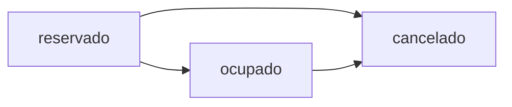

## Overview

The reservation system allows you to book rooms for courses, manage reservation states, and handle the complete lifecycle from initial reservation to cancellation. The system automatically creates recurring reservations based on course duration.

## Reservation States

Reservations follow a defined state lifecycle:



- **reservado**: Initial state when a room is booked
- **ocupado**: Confirmed state when a schedule is generated from the reservation
- **cancelado**: Final state when a reservation is cancelled

<Warning>
Once a reservation is in the `ocupado` state and a schedule has been generated, changing it back to `reservado` may cause inconsistencies. Always cancel and create a new reservation instead.
</Warning>

## Creating Reservations

### Prerequisites

<Steps>
  <Step title="Check Room Availability">
    First, verify the room is available using the `/aulas-disponibles` endpoint.
    
    See [Room Availability Guide](/guides/room-availability) for details.
  </Step>

  <Step title="Gather Required Data">
    Collect all necessary information:
    - Course ID
    - Room ID (from availability check)
    - Teacher ID
    - Time slot details
    - Student count
  </Step>

  <Step title="Create Reservation">
    Submit the reservation request
  </Step>
</Steps>

### API Request

<CodeGroup>

```bash cURL
curl -X POST http://localhost:8000/reservar-aula \
  -H "Content-Type: application/json" \
  -d '{
    "asignatura_id": "A003",
    "aula_id": "AU001",
    "docente_id": "D003",
    "fecha": "23/07/2025",
    "dia": "Miércoles",
    "hora_inicio": "14:00",
    "hora_fin": "17:00",
    "cantidad_estudiantes": 26,
    "semestre": 1,
    "id_usuario": "USR001"
  }'
```

```python Python
import requests

url = "http://localhost:8000/reservar-aula"
payload = {
    "asignatura_id": "A003",
    "aula_id": "AU001",
    "docente_id": "D003",
    "fecha": "23/07/2025",
    "dia": "Miércoles",
    "hora_inicio": "14:00",
    "hora_fin": "17:00",
    "cantidad_estudiantes": 26,
    "semestre": 1,
    "id_usuario": "USR001"
}

response = requests.post(url, json=payload)
result = response.json()

if result['success']:
    print(f"Created {len(result['reservas'])} reservations")
    for reserva in result['reservas']:
        print(f"  - {reserva['id']}: {reserva['fecha']}")
else:
    print(f"Error: {result['message']}")
```

```javascript JavaScript
const response = await fetch('http://localhost:8000/reservar-aula', {
  method: 'POST',
  headers: {
    'Content-Type': 'application/json'
  },
  body: JSON.stringify({
    asignatura_id: 'A003',
    aula_id: 'AU001',
    docente_id: 'D003',
    fecha: '23/07/2025',
    dia: 'Miércoles',
    hora_inicio: '14:00',
    hora_fin: '17:00',
    cantidad_estudiantes: 26,
    semestre: 1,
    id_usuario: 'USR001'
  })
});

const result = await response.json();
if (result.success) {
  console.log(`Created ${result.reservas.length} reservations`);
}
```

</CodeGroup>

### Request Parameters

| Parameter | Type | Required | Description |
|-----------|------|----------|-------------|
| `asignatura_id` | string | Yes | Course identifier |
| `aula_id` | string | Yes | Room identifier |
| `docente_id` | string | Yes | Teacher identifier |
| `fecha` | string | Yes | Start date in DD/MM/YYYY format |
| `dia` | string | Yes | Day of the week |
| `hora_inicio` | string | Yes | Start time (HH:MM) |
| `hora_fin` | string | Yes | End time (HH:MM) |
| `cantidad_estudiantes` | integer | Yes | Number of students |
| `semestre` | integer | Yes | Semester (1-10) |
| `id_usuario` | string | Yes | User making the reservation |

### Response Format

<CodeGroup>

```json Success Response
{
  "success": true,
  "message": "Reserva realizada para 13 sesiones.",
  "reservas": [
    {
      "id": "PROG098",
      "aula_id": "AU001",
      "docente_id": "D003",
      "asignatura_id": "A003",
      "fecha": "23/07/2025",
      "hora_inicio": "14:00",
      "hora_fin": "17:00",
      "id_usuario": "USR001",
      "fecha_creacion": "2025-06-19",
      "hora_creacion": "00:41",
      "estado": "reservado",
      "dia": "Miércoles",
      "semestre": 1,
      "estudiantes": 26
    },
    {
      "id": "PROG099",
      "aula_id": "AU001",
      "docente_id": "D003",
      "asignatura_id": "A003",
      "fecha": "30/07/2025",
      "hora_inicio": "14:00",
      "hora_fin": "17:00",
      "id_usuario": "USR001",
      "fecha_creacion": "2025-06-19",
      "hora_creacion": "00:41",
      "estado": "reservado",
      "dia": "Miércoles",
      "semestre": 1,
      "estudiantes": 26
    }
  ]
}
```

```json Error Response
{
  "success": false,
  "message": "El aula ya está reservada el 23/07/2025 en ese horario."
}
```

</CodeGroup>

<Note>
**Recurring Reservations**: The system automatically creates multiple reservations based on the course duration. A 3-month course will create ~13 weekly reservations.
</Note>

## Managing Reservations

### List All Reservations

```bash
curl http://localhost:8000/programaciones
```

```python
import requests

response = requests.get("http://localhost:8000/programaciones")
data = response.json()

print(f"Total reservations: {data['total']}")
for prog in data['programaciones']:
    print(f"{prog['id']}: {prog['asignatura_id']} - {prog['estado']}")
```

### Get Single Reservation

```bash
curl http://localhost:8000/programaciones/PROG098
```

```python
import requests

prog_id = "PROG098"
response = requests.get(f"http://localhost:8000/programaciones/{prog_id}")
prog = response.json()

print(f"Room: {prog['aula_id']}")
print(f"Course: {prog['asignatura_id']}")
print(f"Date: {prog['fecha']}")
print(f"Time: {prog['hora_inicio']}-{prog['hora_fin']}")
print(f"Status: {prog['estado']}")
```

## Updating Reservation State

### Change State

Update a reservation's state in the lifecycle:

<CodeGroup>

```bash Confirm Reservation (ocupado)
curl -X PUT http://localhost:8000/programaciones/PROG098/estado?nuevo_estado=ocupado
```

```bash Cancel Reservation
curl -X PUT http://localhost:8000/programaciones/PROG098/estado?nuevo_estado=cancelado
```

```python Python
import requests

def change_reservation_state(prog_id, new_state):
    """Change reservation state."""
    url = f"http://localhost:8000/programaciones/{prog_id}/estado"
    params = {"nuevo_estado": new_state}
    
    response = requests.put(url, params=params)
    result = response.json()
    
    if result['success']:
        print(f"State changed to {new_state}")
        return result['programacion']
    else:
        print(f"Error: {result['message']}")
        return None

# Mark as occupied
prog = change_reservation_state("PROG098", "ocupado")

# Cancel reservation
prog = change_reservation_state("PROG098", "cancelado")
```

</CodeGroup>

### Valid State Transitions

| From | To | Description |
|------|----|-----------|
| reservado | ocupado | Confirm reservation and generate schedule |
| reservado | cancelado | Cancel before confirmation |
| ocupado | cancelado | Cancel after confirmation |

<Warning>
**Invalid Transitions**: You cannot change `cancelado` back to other states, or `ocupado` back to `reservado`. Create a new reservation instead.
</Warning>

## Cancelling Reservations

### Quick Cancel

The DELETE endpoint is a shortcut to cancel a reservation:

```bash
curl -X DELETE http://localhost:8000/programaciones/PROG098
```

```python
import requests

def cancel_reservation(prog_id):
    """Cancel a reservation using DELETE."""
    url = f"http://localhost:8000/programaciones/{prog_id}"
    response = requests.delete(url)
    result = response.json()
    
    if result['success']:
        print(f"Reservation {prog_id} cancelled")
        return True
    else:
        print(f"Error: {result['message']}")
        return False

# Cancel
cancel_reservation("PROG098")
```

<Tip>
The DELETE endpoint is equivalent to `PUT /programaciones/{id}/estado?nuevo_estado=cancelado` but more semantic for cancellations.
</Tip>

## Common Use Cases

### Complete Reservation Workflow

```python
import requests
from typing import Optional, Dict, List

class ReservationManager:
    """Complete reservation management workflow."""
    
    def __init__(self, base_url: str = "http://localhost:8000"):
        self.base_url = base_url
    
    def find_and_reserve(self, course_id: str, students: int, day: str, 
                        time_start: str, time_end: str, semester: int,
                        teacher_id: str, user_id: str, start_date: str) -> Optional[Dict]:
        """Complete workflow: check availability and create reservation."""
        
        # Step 1: Check availability
        print(f"Checking availability for {course_id}...")
        avail_response = requests.post(
            f"{self.base_url}/aulas-disponibles",
            json={
                "asignatura_id": course_id,
                "hora_inicio": time_start,
                "hora_fin": time_end,
                "dia": day,
                "cantidad_estudiantes": students,
                "semestre": semester
            }
        )
        avail_data = avail_response.json()
        
        if avail_data['total_disponibles'] == 0:
            print("No rooms available")
            return None
        
        # Step 2: Select best room (highest capacity)
        available_rooms = avail_data['aulas_disponibles']
        best_room = max(available_rooms, key=lambda r: r['capacidad'])
        print(f"Selected room: {best_room['nombre']} (capacity: {best_room['capacidad']})")
        
        # Step 3: Create reservation
        print(f"Creating reservation...")
        reserve_response = requests.post(
            f"{self.base_url}/reservar-aula",
            json={
                "asignatura_id": course_id,
                "aula_id": best_room['id'],
                "docente_id": teacher_id,
                "fecha": start_date,
                "dia": day,
                "hora_inicio": time_start,
                "hora_fin": time_end,
                "cantidad_estudiantes": students,
                "semestre": semester,
                "id_usuario": user_id
            }
        )
        reserve_data = reserve_response.json()
        
        if reserve_data['success']:
            print(f"Success! Created {len(reserve_data['reservas'])} reservations")
            return reserve_data
        else:
            print(f"Failed: {reserve_data['message']}")
            return None

# Usage
manager = ReservationManager()
result = manager.find_and_reserve(
    course_id="A003",
    students=26,
    day="Miércoles",
    time_start="14:00",
    time_end="17:00",
    semester=1,
    teacher_id="D003",
    user_id="USR001",
    start_date="23/07/2025"
)
```

### Batch State Updates

Update multiple reservations at once:

```python
import requests
from typing import List

def bulk_update_state(prog_ids: List[str], new_state: str) -> Dict:
    """Update state for multiple reservations."""
    results = {
        'success': [],
        'failed': []
    }
    
    for prog_id in prog_ids:
        try:
            response = requests.put(
                f"http://localhost:8000/programaciones/{prog_id}/estado",
                params={"nuevo_estado": new_state}
            )
            result = response.json()
            
            if result['success']:
                results['success'].append(prog_id)
            else:
                results['failed'].append({
                    'id': prog_id,
                    'reason': result['message']
                })
        except Exception as e:
            results['failed'].append({
                'id': prog_id,
                'reason': str(e)
            })
    
    return results

# Cancel all reservations for a course
reservation_ids = ["PROG098", "PROG099", "PROG100"]
results = bulk_update_state(reservation_ids, "cancelado")

print(f"Successfully cancelled: {len(results['success'])}")
print(f"Failed: {len(results['failed'])}")
```

### Query Reservations by Filters

```python
import requests
from typing import List, Dict

def filter_reservations(estado: str = None, semestre: int = None, 
                        aula_id: str = None) -> List[Dict]:
    """Filter reservations by various criteria."""
    response = requests.get("http://localhost:8000/programaciones")
    data = response.json()
    
    programaciones = data['programaciones']
    
    # Apply filters
    if estado:
        programaciones = [p for p in programaciones if p.get('estado') == estado]
    
    if semestre:
        programaciones = [p for p in programaciones if p.get('semestre') == semestre]
    
    if aula_id:
        programaciones = [p for p in programaciones if p.get('aula_id') == aula_id]
    
    return programaciones

# Get all reserved (not confirmed) reservations for semester 1
reserved = filter_reservations(estado="reservado", semestre=1)
print(f"Found {len(reserved)} reserved slots for semester 1")

# Get all reservations for a specific room
room_reservations = filter_reservations(aula_id="AU001")
print(f"Room AU001 has {len(room_reservations)} reservations")
```

### Handle Conflicts

```python
import requests
from datetime import datetime, timedelta

def find_alternative_slot(course_id: str, students: int, preferred_day: str,
                         time_start: str, time_end: str, semester: int) -> Dict:
    """Find alternative time slot if preferred slot is unavailable."""
    days = ['Lunes', 'Martes', 'Miércoles', 'Jueves', 'Viernes']
    
    # Try preferred day first
    day_order = [preferred_day] + [d for d in days if d != preferred_day]
    
    for day in day_order:
        response = requests.post(
            "http://localhost:8000/aulas-disponibles",
            json={
                "asignatura_id": course_id,
                "hora_inicio": time_start,
                "hora_fin": time_end,
                "dia": day,
                "cantidad_estudiantes": students,
                "semestre": semester
            }
        )
        data = response.json()
        
        if data['total_disponibles'] > 0:
            return {
                'found': True,
                'day': day,
                'rooms': data['aulas_disponibles'],
                'is_preferred': day == preferred_day
            }
    
    return {'found': False}

# Usage
alternative = find_alternative_slot(
    "A003", 26, "Miércoles", "14:00", "17:00", 1
)

if alternative['found']:
    if alternative['is_preferred']:
        print(f"Room available on preferred day: {alternative['day']}")
    else:
        print(f"Alternative found on: {alternative['day']}")
    print(f"Available rooms: {len(alternative['rooms'])}")
else:
    print("No alternatives found")
```

## Error Handling

<CodeGroup>

```python Comprehensive Error Handling
import requests
from typing import Dict, Optional

def create_reservation_safe(course_id: str, room_id: str, teacher_id: str,
                           date: str, day: str, time_start: str, time_end: str,
                           students: int, semester: int, user_id: str) -> Dict:
    """Create reservation with comprehensive error handling."""
    try:
        # Validate inputs
        if students <= 0:
            return {'success': False, 'error': 'Invalid student count'}
        
        if not (1 <= semester <= 10):
            return {'success': False, 'error': 'Invalid semester'}
        
        # Make request
        response = requests.post(
            "http://localhost:8000/reservar-aula",
            json={
                "asignatura_id": course_id,
                "aula_id": room_id,
                "docente_id": teacher_id,
                "fecha": date,
                "dia": day,
                "hora_inicio": time_start,
                "hora_fin": time_end,
                "cantidad_estudiantes": students,
                "semestre": semester,
                "id_usuario": user_id
            },
            timeout=10
        )
        
        # Handle HTTP errors
        if response.status_code == 400:
            error_detail = response.json().get('detail', 'Bad request')
            return {'success': False, 'error': f'Validation error: {error_detail}'}
        elif response.status_code == 404:
            return {'success': False, 'error': 'Resource not found'}
        elif response.status_code != 200:
            return {'success': False, 'error': f'Server error: {response.status_code}'}
        
        # Parse response
        data = response.json()
        return data
        
    except requests.Timeout:
        return {'success': False, 'error': 'Request timeout'}
    except requests.ConnectionError:
        return {'success': False, 'error': 'Connection failed'}
    except Exception as e:
        return {'success': False, 'error': f'Unexpected error: {str(e)}'}

# Usage
result = create_reservation_safe(
    course_id="A003",
    room_id="AU001",
    teacher_id="D003",
    date="23/07/2025",
    day="Miércoles",
    time_start="14:00",
    time_end="17:00",
    students=26,
    semester=1,
    user_id="USR001"
)

if result['success']:
    print(f"Created {len(result['reservas'])} reservations")
else:
    print(f"Error: {result['error']}")
```

</CodeGroup>

## Best Practices

<CardGroup cols={2}>
  <Card title="Always Check First" icon="magnifying-glass">
    Always check room availability before attempting to create a reservation.
  </Card>
  
  <Card title="Handle Recurring Dates" icon="calendar-days">
    Remember that one reservation request creates multiple recurring sessions based on course duration.
  </Card>
  
  <Card title="State Transitions" icon="arrow-right-arrow-left">
    Follow proper state transition rules. Never try to revert `ocupado` to `reservado`.
  </Card>
  
  <Card title="Bulk Operations" icon="layer-group">
    When updating multiple reservations, implement retry logic and track failures.
  </Card>
</CardGroup>

## Next Steps

<CardGroup cols={2}>
  <Card title="Schedule Generation" icon="calendar" href="/guides/schedule-generation">
    Learn how to generate schedules from reservations
  </Card>
  
  <Card title="Room Availability" icon="door-open" href="/guides/room-availability">
    Check room availability before reserving
  </Card>
</CardGroup>
