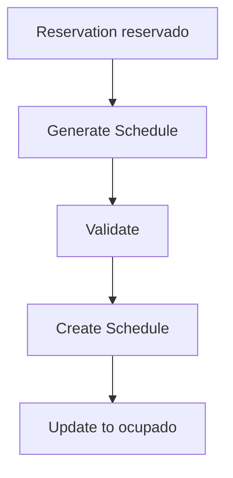

## Overview

Schedule generation transforms room reservations into confirmed academic schedules. The system uses the Builder pattern with a Facade to create different types of schedules (normal, lab, virtual, or blocked) while applying validation rules.

## How It Works



<Steps>
  <Step title="Reservation Required">
    Start with a reservation in `reservado` state
  </Step>
  
  <Step title="Builder Creates Schedule">
    The Builder pattern constructs the appropriate schedule type based on the course
  </Step>
  
  <Step title="Facade Validates">
    The Facade applies all validation rules via the constraint chain
  </Step>
  
  <Step title="State Update">
    Reservation changes to `ocupado` and links to the schedule
  </Step>
</Steps>

## Schedule Types

The system generates different schedule types based on course type:

| Course Type | Schedule Type | Special Handling |
|-------------|--------------|------------------|
| teorica | Normal | Standard validation |
| laboratorio | Lab | Requires lab rooms |
| virtual | Virtual | May not require physical room |
| bloqueo | Blocked | Blocks time slots |
| hibrida | Normal | Can use hybrid rooms |

## Generate from Single Reservation

### API Request

<CodeGroup>

```bash cURL
curl -X POST http://localhost:8000/crear-horario-desde-programacion/PROG005
```

```python Python
import requests

def generate_schedule_from_reservation(prog_id: str):
    """Generate schedule from a single reservation."""
    url = f"http://localhost:8000/crear-horario-desde-programacion/{prog_id}"
    response = requests.post(url)
    
    result = response.json()
    
    if result['success']:
        print(f"Schedule created: {result['horario']['id']}")
        print(f"Type: {result['tipo_horario']}")
        print(f"Reservation updated to: {result['programacion_actualizada']['estado']}")
        return result['horario']
    else:
        print(f"Error: {result['error']}")
        return None

# Generate schedule
schedule = generate_schedule_from_reservation("PROG005")
```

```javascript JavaScript
async function generateSchedule(progId) {
  const response = await fetch(
    `http://localhost:8000/crear-horario-desde-programacion/${progId}`,
    { method: 'POST' }
  );
  
  const result = await response.json();
  
  if (result.success) {
    console.log(`Schedule created: ${result.horario.id}`);
    return result.horario;
  } else {
    console.error(`Error: ${result.error}`);
    return null;
  }
}

await generateSchedule('PROG005');
```

</CodeGroup>

### Response Format

<CodeGroup>

```json Success Response
{
  "success": true,
  "horario": {
    "id": "H_PROG005_20250618_141514",
    "tipo": "normal",
    "asignatura": {
      "id": "A003",
      "nombre": "Estructura de Datos",
      "tipo": "teorica"
    },
    "aula": {
      "id": "AU004",
      "nombre": "Aula 201",
      "capacidad": 35
    },
    "docente": {
      "id": "D003",
      "nombre": "Prof. García"
    },
    "sede": {
      "id": "S002",
      "nombre": "Sede Norte"
    },
    "start_time": "14:00",
    "end_time": "16:00",
    "dia": "Jueves",
    "fecha": "2024-07-22",
    "estado": "confirmado",
    "created_at": "2025-06-18T14:15:14.297423"
  },
  "programacion_actualizada": {
    "id": "PROG005",
    "estado": "ocupado",
    "horario_id": "H_PROG005_20250618_141514",
    "fecha_confirmacion": "2025-06-18T14:15:14.297423"
  },
  "tipo_horario": "normal"
}
```

```json Error Response
{
  "success": false,
  "error": "La programación debe estar en estado 'reservado', actual: ocupado"
}
```

</CodeGroup>

<Warning>
**State Requirement**: The reservation must be in `reservado` state. Attempting to generate a schedule from an already `ocupado` or `cancelado` reservation will fail.
</Warning>

## Generate Complete Semester Schedule

Generate schedules for all reservations in a semester:

### API Request

<CodeGroup>

```bash cURL (with validation)
curl -X POST "http://localhost:8000/crear-horario-completo-semestre/1?validar_conjunto=true"
```

```bash cURL (skip validation)
curl -X POST "http://localhost:8000/crear-horario-completo-semestre/1?validar_conjunto=false"
```

```python Python
import requests

def generate_semester_schedules(semester: int, validate: bool = True):
    """Generate all schedules for a semester."""
    url = f"http://localhost:8000/crear-horario-completo-semestre/{semester}"
    params = {"validar_conjunto": validate}
    
    response = requests.post(url, params=params)
    result = response.json()
    
    if result['success']:
        print(f"Semester {semester} schedules created")
        print(f"Total: {result['total_horarios']}")
        print(f"Validation: {result['validacion_conjunto']}")
        
        if result['errores']:
            print(f"\nErrors encountered: {len(result['errores'])}")
            for error in result['errores']:
                print(f"  - {error}")
        
        print(f"\nStatistics:")
        for key, value in result['estadisticas'].items():
            print(f"  {key}: {value}")
        
        return result
    else:
        print(f"Failed: {result['error']}")
        return None

# Generate with validation
result = generate_semester_schedules(1, validate=True)
```

</CodeGroup>

### Query Parameters

| Parameter | Type | Default | Description |
|-----------|------|---------|-------------|
| `validar_conjunto` | boolean | true | Validate complete schedule set for conflicts |

### Response Format

```json
{
  "success": true,
  "semestre": 1,
  "total_horarios": 45,
  "horarios": [
    {
      "id": "H_PROG007_20250618_151314",
      "tipo": "normal",
      "asignatura": {...},
      "aula": {...},
      "start_time": "07:00",
      "end_time": "09:00",
      "dia": "Miércoles"
    }
  ],
  "errores": [
    "Programación PROG099: Error al crear horario: Validation failed"
  ],
  "estadisticas": {
    "total_horarios_creados": 45,
    "total_aulas_utilizadas": 4,
    "total_docentes": 3,
    "porcentaje_ocupacion": 67.5
  },
  "validacion_conjunto": "OK"
}
```

<Note>
**Partial Success**: The operation continues even if some reservations fail. Check the `errores` array for details on failures.
</Note>

## View Generated Schedules

Query schedules by semester:

```bash
curl http://localhost:8000/horarios-por-semestre/1
```

```python
import requests

def get_semester_schedules(semester: int):
    """Get all schedules for a semester."""
    url = f"http://localhost:8000/horarios-por-semestre/{semester}"
    response = requests.get(url)
    data = response.json()
    
    print(f"Semester {semester}: {data['total_horarios']} schedules")
    
    # Group by day
    by_day = {}
    for horario in data['horarios']:
        day = horario['dia']
        if day not in by_day:
            by_day[day] = []
        by_day[day].append(horario)
    
    # Display by day
    for day, schedules in sorted(by_day.items()):
        print(f"\n{day}:")
        for s in schedules:
            print(f"  {s['hora_inicio']}-{s['hora_fin']}: "
                  f"{s['asignatura_id']} in {s['aula_id']}")
    
    return data

schedules = get_semester_schedules(1)
```

## Common Use Cases

### Generate with Pre-validation

```python
import requests

def generate_with_precheck(prog_id: str):
    """Generate schedule with pre-validation."""
    
    # Step 1: Get reservation details
    prog_response = requests.get(f"http://localhost:8000/programaciones/{prog_id}")
    prog = prog_response.json()
    
    if prog['estado'] != 'reservado':
        print(f"Cannot generate: reservation is {prog['estado']}")
        return None
    
    # Step 2: Verify course exists
    data_response = requests.get("http://localhost:8000/datos")
    data = data_response.json()
    
    asignatura = next(
        (a for a in data['asignaturas'] if a['id'] == prog['asignatura_id']),
        None
    )
    
    if not asignatura:
        print(f"Course {prog['asignatura_id']} not found")
        return None
    
    # Step 3: Verify room exists and is active
    aula = next(
        (a for a in data['aulas'] if a['id'] == prog['aula_id']),
        None
    )
    
    if not aula or aula.get('estado') != 'activo':
        print(f"Room {prog['aula_id']} not available")
        return None
    
    # Step 4: Generate schedule
    print("Pre-validation passed. Generating schedule...")
    schedule_response = requests.post(
        f"http://localhost:8000/crear-horario-desde-programacion/{prog_id}"
    )
    result = schedule_response.json()
    
    if result['success']:
        print(f"Success! Schedule ID: {result['horario']['id']}")
        return result
    else:
        print(f"Generation failed: {result['error']}")
        return None

# Usage
result = generate_with_precheck("PROG005")
```

### Batch Schedule Generation

```python
import requests
from typing import List, Dict

def batch_generate_schedules(prog_ids: List[str]) -> Dict:
    """Generate schedules for multiple reservations."""
    results = {
        'success': [],
        'failed': [],
        'skipped': []
    }
    
    for prog_id in prog_ids:
        # Check state
        prog_response = requests.get(
            f"http://localhost:8000/programaciones/{prog_id}"
        )
        prog = prog_response.json()
        
        if prog['estado'] != 'reservado':
            results['skipped'].append({
                'id': prog_id,
                'reason': f"Already {prog['estado']}"
            })
            continue
        
        # Generate
        schedule_response = requests.post(
            f"http://localhost:8000/crear-horario-desde-programacion/{prog_id}"
        )
        result = schedule_response.json()
        
        if result['success']:
            results['success'].append({
                'prog_id': prog_id,
                'schedule_id': result['horario']['id']
            })
        else:
            results['failed'].append({
                'prog_id': prog_id,
                'error': result['error']
            })
    
    # Summary
    print(f"\nBatch Generation Complete")
    print(f"Success: {len(results['success'])}")
    print(f"Failed: {len(results['failed'])}")
    print(f"Skipped: {len(results['skipped'])}")
    
    return results

# Generate schedules for multiple reservations
reservations = ["PROG005", "PROG006", "PROG007"]
results = batch_generate_schedules(reservations)
```

### Schedule Conflict Detection

```python
import requests
from collections import defaultdict

def detect_schedule_conflicts(semester: int) -> List[Dict]:
    """Detect scheduling conflicts in a semester."""
    # Get all schedules
    response = requests.get(
        f"http://localhost:8000/horarios-por-semestre/{semester}"
    )
    data = response.json()
    schedules = data['horarios']
    
    conflicts = []
    
    # Group by room and day
    room_schedules = defaultdict(lambda: defaultdict(list))
    for schedule in schedules:
        room_id = schedule['aula_id']
        day = schedule['dia']
        room_schedules[room_id][day].append(schedule)
    
    # Check for time overlaps
    for room_id, days in room_schedules.items():
        for day, day_schedules in days.items():
            # Sort by start time
            day_schedules.sort(key=lambda s: s['hora_inicio'])
            
            for i in range(len(day_schedules) - 1):
                current = day_schedules[i]
                next_schedule = day_schedules[i + 1]
                
                # Check overlap
                if current['hora_fin'] > next_schedule['hora_inicio']:
                    conflicts.append({
                        'room': room_id,
                        'day': day,
                        'schedule1': {
                            'id': current['horario_id'],
                            'time': f"{current['hora_inicio']}-{current['hora_fin']}",
                            'course': current['asignatura_id']
                        },
                        'schedule2': {
                            'id': next_schedule['horario_id'],
                            'time': f"{next_schedule['hora_inicio']}-{next_schedule['hora_fin']}",
                            'course': next_schedule['asignatura_id']
                        }
                    })
    
    if conflicts:
        print(f"Found {len(conflicts)} conflicts:")
        for conflict in conflicts:
            print(f"\n{conflict['room']} on {conflict['day']}:")
            print(f"  {conflict['schedule1']['time']}: {conflict['schedule1']['course']}")
            print(f"  {conflict['schedule2']['time']}: {conflict['schedule2']['course']}")
    else:
        print("No conflicts detected")
    
    return conflicts

# Check for conflicts
conflicts = detect_schedule_conflicts(1)
```

### Export Schedule

```python
import requests
import csv
from typing import List

def export_semester_schedule_csv(semester: int, filename: str):
    """Export semester schedule to CSV."""
    # Get schedules
    response = requests.get(
        f"http://localhost:8000/horarios-por-semestre/{semester}"
    )
    data = response.json()
    schedules = data['horarios']
    
    # Write to CSV
    with open(filename, 'w', newline='', encoding='utf-8') as csvfile:
        fieldnames = [
            'Schedule ID', 'Day', 'Start Time', 'End Time',
            'Course', 'Room', 'Teacher', 'Status'
        ]
        writer = csv.DictWriter(csvfile, fieldnames=fieldnames)
        
        writer.writeheader()
        for schedule in schedules:
            writer.writerow({
                'Schedule ID': schedule['horario_id'],
                'Day': schedule['dia'],
                'Start Time': schedule['hora_inicio'],
                'End Time': schedule['hora_fin'],
                'Course': schedule['asignatura_id'],
                'Room': schedule['aula_id'],
                'Teacher': schedule['docente_id'],
                'Status': schedule['estado']
            })
    
    print(f"Exported {len(schedules)} schedules to {filename}")

# Export
export_semester_schedule_csv(1, 'semester1_schedule.csv')
```

## Understanding the Builder Pattern

The system uses the Builder pattern to construct schedules:

```python
# Conceptual example of the Builder usage
class ScheduleBuilder:
    """Builder pattern for creating schedules."""
    
    def __init__(self):
        self.schedule = {}
    
    def set_type(self, course_type):
        """Determine schedule type from course type."""
        type_mapping = {
            'laboratorio': 'laboratorio',
            'virtual': 'virtual',
            'bloqueo': 'bloqueo',
            'teorica': 'normal',
            'hibrida': 'normal'
        }
        self.schedule['tipo'] = type_mapping.get(course_type, 'normal')
        return self
    
    def set_asignatura(self, asignatura):
        self.schedule['asignatura'] = asignatura
        return self
    
    def set_aula(self, aula):
        self.schedule['aula'] = aula
        return self
    
    def set_docente(self, docente):
        self.schedule['docente'] = docente
        return self
    
    def set_time(self, start_time, end_time, dia):
        self.schedule['start_time'] = start_time
        self.schedule['end_time'] = end_time
        self.schedule['dia'] = dia
        return self
    
    def build(self):
        """Build and return the schedule."""
        return self.schedule

# Usage (conceptual)
builder = ScheduleBuilder()
schedule = (builder
    .set_type('laboratorio')
    .set_asignatura(asignatura_data)
    .set_aula(aula_data)
    .set_docente(docente_data)
    .set_time('14:00', '17:00', 'Miércoles')
    .build()
)
```

## Validation During Generation

When generating schedules, the Facade applies all validation rules:

1. **Capacity Check**: Room has enough seats
2. **Compatibility Check**: Room type matches course type
3. **Availability Check**: No scheduling conflicts
4. **Resource Check**: Required resources are available
5. **Teacher Check**: Teacher not double-booked
6. **Entity Integrity**: All referenced entities exist

<Tip>
If validation fails during generation, the reservation remains in `reservado` state. Fix the issue and try again.
</Tip>

## Error Handling

```python
import requests

def generate_schedule_safe(prog_id: str) -> Dict:
    """Generate schedule with comprehensive error handling."""
    try:
        # Check if reservation exists
        prog_response = requests.get(
            f"http://localhost:8000/programaciones/{prog_id}"
        )
        
        if prog_response.status_code == 404:
            return {'success': False, 'error': 'Reservation not found'}
        
        prog = prog_response.json()
        
        # Check state
        if prog['estado'] != 'reservado':
            return {
                'success': False,
                'error': f"Cannot generate from {prog['estado']} reservation"
            }
        
        # Generate schedule
        schedule_response = requests.post(
            f"http://localhost:8000/crear-horario-desde-programacion/{prog_id}",
            timeout=30
        )
        
        if schedule_response.status_code == 400:
            error_detail = schedule_response.json().get('detail', 'Bad request')
            return {'success': False, 'error': error_detail}
        
        result = schedule_response.json()
        return result
        
    except requests.Timeout:
        return {'success': False, 'error': 'Request timeout'}
    except requests.ConnectionError:
        return {'success': False, 'error': 'Connection failed'}
    except Exception as e:
        return {'success': False, 'error': f'Unexpected error: {str(e)}'}

# Usage
result = generate_schedule_safe("PROG005")
if result['success']:
    print(f"Schedule created: {result['horario']['id']}")
else:
    print(f"Error: {result['error']}")
```

## Best Practices

<CardGroup cols={2}>
  <Card title="Validate First" icon="shield-check">
    Always verify reservation state before attempting schedule generation.
  </Card>
  
  <Card title="Handle Partial Failures" icon="triangle-exclamation">
    When generating semester schedules, some may fail. Handle partial success gracefully.
  </Card>
  
  <Card title="Use Validation" icon="check-double">
    Enable conjunto validation for semester-wide generation to catch conflicts.
  </Card>
  
  <Card title="Monitor State" icon="eye">
    Track reservation state changes to prevent invalid operations.
  </Card>
</CardGroup>

## Next Steps

<CardGroup cols={2}>
  <Card title="Constraint Validation" icon="shield-halved" href="/guides/constraint-validation">
    Learn how the validation chain works
  </Card>
  
  <Card title="Manage Reservations" icon="calendar-check" href="/guides/reservations">
    Create and manage room reservations
  </Card>
</CardGroup>
